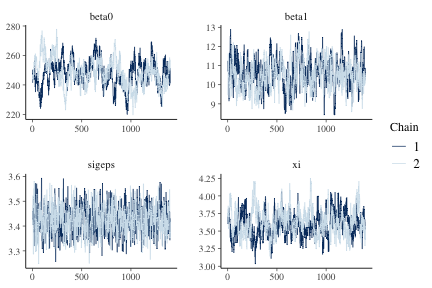
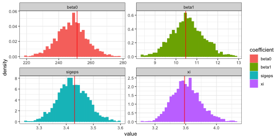
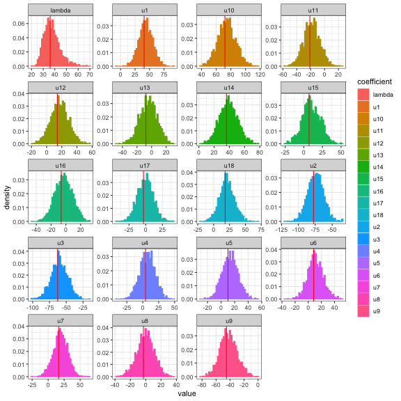

## Introduction

This vignette demonstrates fitting a linear mixed effects regression model via Hamiltonian Monte Carlo (HMC) using the **hmclearn** package,


```r
library(hmclearn)
```

We specify the model and prior distributions for $\mathbf{u}$ and $\boldsymbol\epsilon$,

$$
\begin{aligned}
\mathbf{y} &= \mathbf{X}\boldsymbol\beta + \mathbf{Z}\mathbf{u} + \boldsymbol\epsilon, \\
\mathbf{u} &\sim N(0, \mathbf{G}),  \\
\boldsymbol\epsilon &\sim N(0, \sigma_\epsilon^2).
\end{aligned}
$$

The response for each subject is a vector $\mathbf{y} = (\mathbf{y}_1, ..., \mathbf{y}_n)$ for $n$ subjects $i= 1, ..., n$.  Each subject has $d$ observations $\mathbf{y}_i = (y_{i1}, ..., y_{id})$ and we let $j = 1, ..., d$. The fixed effect design matrix is composed of matrices for each subject, $\mathbf{X} = (\mathbf{X}_1, ..., \mathbf{X}_n)$, and $\mathbf{X}_i \in \mathbb{R}^{d\times (q+1)}$ for the fixed effects parameters $\boldsymbol\beta = (\beta_0, ..., \beta_q)$. The full fixed effects design matrix is therefore $\mathbf{X} \in \mathbb{R}^{nd \times (q+1)}$.

For random effects, $\mathbf{Z} = \text{diag}(\mathbf{Z}_1, ..., \mathbf{Z}_n)$, with individual random effects matrices $\mathbf{Z}_i$ for each of the $i$ subjects. A random intercept model specifies $\mathbf{Z}_i$ as a column vector of ones where $\mathbf{Z}_i = \mathbf{z}_i = \mathbf{1}_d$. The full random effects design matrix $\mathbf{Z} \in \mathbb{R}^{nd\times n}$.  The parameterization for random effects is $\mathbf{u} = (\mathbf{u}_1, ..., \mathbf{u}_n)^T$ with vectors $\mathbf{u}_i$ for each subject. A random intercept model is somewhat simplified where $\mathbf{u}_i = u_i$ denotes a single random intercept parameter for each subject $i$, and $\mathbf{u} = (u_1, ..., u_n)^T$.

We set $\mathbf{u}$ as one of our priors, following a multivariate normal distribution, $\mathbf{u} \sim N(0, \mathbf{G})$. For our random intercept model, the specification of the covariance matrix $\mathbf{G}$ is expanded to facilitate efficient sampling using HMC.  We let $\mathbf{u} = \mathbf{G}^{1/2}\boldsymbol\tau$ where $\mathbf{G}^{1/2} = \lambda \mathbf{I}_n$. An additional parameter $\boldsymbol\tau = (\tau_1, ..., \tau_n)^T$ where each of these parameters is standard normal $\tau_i \sim N(0, 1)$. The full covariance matrix is then $\mathbf{G} = \lambda^2 \mathbf{I}_n \boldsymbol\tau$.

The error for each subject $i$ is $\boldsymbol\epsilon_i \sim N(0, \sigma_{\epsilon}^2 \mathbf{I}_d)$. Since the error distribution is constant for each observations,

$$
\boldsymbol\epsilon \sim N(0, \sigma_{\epsilon}^2 \mathbf{I}_{nd}).
$$

The parameterization approach for this model uses a strategy recommended by Betancourt, Girolami (2013) to facilitate more efficient sampling in HMC.

Further, we select a half-t family of distributions appropriate for hierarchical models per Gelman (2006).  This parameterization is well-behaved around 0, in contrast to inverse gamma, and provides flexibility for informed priors.

We select a parameterization of $\mathbf{G}$ such that the likelihood and its gradient can be derived for HMC.  To this end, we uses LDL decomposition of $\mathbf{G}$ to form a flexible parameterization that can easily handle restrictions (Chan, Jelizkov 2009).

$$
\begin{aligned}
\mathbf{u} &\sim N(0, \mathbf{G}),  \\
\mathbf{G} &= \mathbf{L} \mathbf{D} \mathbf{L}^T,  \\
&= \mathbf{L} \mathbf{D}^{1/2} \mathbf{D}^{1/2} \mathbf{L}^T. \\
\end{aligned}
$$

Let $\boldsymbol{\lambda} = (\lambda_1, ..., \lambda_p)$ denote the diagonal elements of $\mathbf{D}^{1/2}$ where $p$ indicates the number of random effect parameters, specified as *nrandom* in **hmclearn**. A future release of **hmclearn** will allow prior specification for the off-diagonal elements of $L$. For the current version, we let $L = I_{p}$.

$$
\mathbf{D}^{1/2} :=
\begin{pmatrix}
\lambda_1 & 0 & ... & 0 \\
0 & \lambda_2 & 0 ... & 0 \\
... & ... & ... & ... \\
0 & 0 & ... & \lambda_p
\end{pmatrix}, \quad
\mathbf{L} :=
\begin{pmatrix}
1 & 0 & 0 & ... & 0 \\
0 & 1 & 0 & ... & 0 \\
0 & 0 & 1 & ... & ... \\
... & ... & ... & ... & ... \\
0 & 0 & ... & ... & 1 \\
\end{pmatrix}.
$$

We set the prior for $\boldsymbol\beta$ as multivariate normal with variance $\sigma_\beta^2$, a hyperparameter set by the analyst. The priors for $\sigma_\epsilon$ and  $\boldsymbol\lambda$ are half-t per Gelman (2006) on hierarchical models.

$$
\begin{aligned}
\pi(\boldsymbol\beta | \sigma_\beta^2) &\propto N(0, \sigma_\beta^2 \mathbf{I}), \\
\pi(\sigma_\epsilon) &\sim  \left(1 + \frac{1}{\nu_\epsilon}\left(\frac{\sigma_\epsilon}{A_\epsilon} \right)^2 \right)^{-(\nu_\epsilon+1)/2},  \\
\pi(\boldsymbol\lambda) &\sim  \left(1 + \frac{1}{\nu_\lambda}\left(\frac{\boldsymbol\lambda}{A_\lambda} \right)^2 \right)^{-(\nu+1)/2}.
\end{aligned}
$$

We want proposals of $\sigma_\epsilon^2$ over the real number line.  Therfore we derive the distribution of the transformed parameter $\gamma$ based on a change of variable

$$
\begin{aligned}
\gamma &:= \log \sigma_\epsilon, \\
e^\gamma &= \sigma_\epsilon.
\end{aligned}
$$

We need to compute the Jacobian of the transformation

$$
\begin{aligned}
\pi_{\gamma}(\gamma | \nu_\gamma, A_\gamma) &= \pi_{\sigma_\epsilon}(g^{-1}(\gamma))\left\lvert \frac{d\sigma_\epsilon}{d\gamma} \right\rvert, \\
&= \left(1 + \frac{1}{\nu_\gamma} \left(\frac{e^\gamma}{A_\gamma} \right)^2 \right)^{-\frac{\nu_\gamma +1}{2}} e^{\gamma}, \\
&= \left(1 + \frac{1}{\nu_\gamma} \frac{e^{2\gamma}}{A_\gamma^2} \right)^{-\frac{\nu_\gamma +1}{2}} e^{\gamma}, \\
\log \pi(\gamma | \nu_\gamma, A_\gamma) &\propto -\frac{\nu_\gamma+1}{2}\log\left(1 + \frac{1}{\nu_\gamma} \frac{e^{2\gamma}}{A_\gamma^2} \right) + \gamma.
\end{aligned}
$$

We want proposals of $\boldsymbol\lambda$ over the real number line.  Therfore we derive the distribution of the transformed parameter $\boldsymbol\xi$ based on a change of variable

$$
\begin{aligned}
\boldsymbol\xi &:= \log\boldsymbol\lambda,  \\
\boldsymbol\lambda &:= e^{\boldsymbol\xi}.
\end{aligned}
$$

We need to compute the Jacobian of the transformation

$$
\begin{aligned}
\pi_{\boldsymbol\xi}(\boldsymbol\xi) &= \pi_{\boldsymbol\xi}(g^{-1}(\boldsymbol\xi)) \left\lvert \frac{d\boldsymbol\lambda}{d\boldsymbol\xi}  \right\rvert, \\
&= \pi_{\boldsymbol\lambda} (e^{\boldsymbol\xi})\lvert e^{\boldsymbol\xi}\rvert, \\
&= \left(1 + \frac{1}{\nu_\xi} \frac{e^{2\boldsymbol\xi}}{A_{\xi}^2}\right)^{-\frac{\nu_{\xi}+1}{2}}e^{\boldsymbol\xi}, \\
\log \pi(\boldsymbol\xi) &\propto -\frac{\nu_{\xi}+1}{2}\log\left(1 + \frac{1}{\nu_{\xi}} \frac{e^{2\boldsymbol\xi}}{A_{\xi}^2}\right)+ \boldsymbol\xi.
\end{aligned}
$$

## Derive log posterior and gradient for HMC

First, we specify the likelihood and log-likelihood

$$
\begin{aligned}
f(\mathbf{y} | \boldsymbol\beta, \mathbf{u}, \sigma_\epsilon^2) &\propto (\sigma_\epsilon^2)^{-n/2} e^{-\frac{1}{2\sigma_\epsilon^2}(\mathbf{y} - \mathbf{X}\boldsymbol\beta - \mathbf{Z}\mathbf{u})^T (\mathbf{y} - \mathbf{X}\boldsymbol\beta - \mathbf{Z}\mathbf{u})}, \\
\log f(\mathbf{y} | \boldsymbol\beta, \mathbf{u}, \sigma_\epsilon^2) &\propto -{n}\log(\sigma_\epsilon) -\frac{1}{2\sigma_\epsilon^2}(\mathbf{y} - \mathbf{X}\boldsymbol\beta - \mathbf{Z}\mathbf{u})^T (\mathbf{y} - \mathbf{X}\boldsymbol\beta - \mathbf{Z}\mathbf{u}).
\end{aligned}
$$

The posterior is defined for priors on $\boldsymbol\beta$, $\mathbf{u}$, $\sigma_\epsilon^2$, and $\mathbf{G}$, with dependent vector $\mathbf{y}$ and design matrices $\mathbf{X}$ and $\mathbf{Z}$.

$$
\begin{aligned}
f(\boldsymbol\beta, \mathbf{u}, \sigma_\epsilon^2, \mathbf{G} | \mathbf{y}, \mathbf{X}, \mathbf{Z}, \sigma_\beta^2) &\propto f(\mathbf{y} | \boldsymbol\beta, \mathbf{u}, \sigma_\epsilon^2, \mathbf{G})  \pi(\boldsymbol\beta, \mathbf{u}, \sigma_\epsilon^2, \mathbf{G} | \sigma_\beta^2),  \\
&\propto f(\mathbf{y} | \boldsymbol\beta, \mathbf{u}, \sigma_\epsilon^2, \mathbf{G}) \pi(\boldsymbol\beta | \sigma_\beta^2) \pi(\sigma_\epsilon^2) \pi(\mathbf{u}, \mathbf{G}), \\
&\propto f(\mathbf{y} | \boldsymbol\beta, \mathbf{u}, \sigma_\epsilon^2, \mathbf{G}) \pi(\boldsymbol\beta | \sigma_\beta^2) \pi(\sigma_\epsilon^2) \pi(\mathbf{u} | \mathbf{G}) \pi(\mathbf{G}), \\
\log f(\boldsymbol\beta, \mathbf{u}, \sigma_\epsilon^2, \mathbf{G} | \mathbf{y}, \mathbf{X}, \mathbf{Z}, \sigma_\beta^2) &\propto \log f(\mathbf{y} | \boldsymbol\beta, \mathbf{u}, \sigma_\epsilon^2, \mathbf{G}) + \log \pi(\boldsymbol\beta | \sigma_\beta^2) + \log \pi(\sigma_\epsilon^2)+ \log \pi(\mathbf{u}|\mathbf{G}) + \log \pi(\mathbf{G}), \\
\log f(\boldsymbol\beta,\boldsymbol\tau, \gamma, \boldsymbol\xi | y, X, Z, \sigma_\beta^2, \nu_\gamma, A_\gamma, \nu_\xi, A_\xi) &\propto \log f(\mathbf{y} | \boldsymbol\beta, \boldsymbol\tau, \gamma, \boldsymbol\xi) + \log \pi(\boldsymbol\beta | \sigma_\beta^2) + \log \pi(\gamma | \nu_\gamma, A_\gamma)+ \\
&\qquad\log \pi(\tau) + \log \pi(\boldsymbol\xi | \nu_\xi, A_\xi).
\end{aligned}
$$

One additional notation is added to simplify the log likelihood, log posterior, and gradient formulations, $\widetilde{\mathbf{D}}^{1/2} = \mathbf{I}_n \otimes \mathbf{D}^{1/2}$. Note that $\widetilde{\mathbf{D}}^{1/2} = \left(\widetilde{\mathbf{D}}^{1/2}\right ) ^T$ due to symmetry. We omit $\mathbf{L}$ since this is currently defined as the identity matrix.

We write the re-parameterized log likelihood omitting constants,

$$
\begin{aligned}
\log f(\mathbf{y}|\mathbf{X}, \mathbf{Z}, \boldsymbol\beta, \boldsymbol\tau, \boldsymbol\xi, \gamma) \propto -nd\log\gamma - \frac{e^{-2\gamma}}{2} (\mathbf{y} - \mathbf{X}\boldsymbol\beta - \mathbf{Z}\widetilde{\mathbf{D}}^{1/2}\boldsymbol\tau)^T(\mathbf{y} - \mathbf{X}\boldsymbol\beta - \mathbf{Z}\widetilde{\mathbf{D}}^{1/2}\boldsymbol\tau).
\end{aligned}
$$

Next, we express the log priors that we use with transformations, omitting constants. Note that the log densities of the priors with log densities include an additive term for the transformed distribution (i.e. $\xi$ and $\gamma$),

$$
\begin{aligned}
\log \pi(\boldsymbol\beta | \sigma_\beta^2) &\propto -\frac{\boldsymbol\beta^T \boldsymbol\beta}{2\sigma_\beta^2}, \\
\log \pi(\xi_{jj} | \nu_\xi, A_\xi) &\propto -\frac{\nu_\xi + 1}{2} \log \left( 1 + \frac{1}{\nu_\xi} \left(\frac{e^\xi_{jj}}{A_\xi} \right)^2 \right) + \xi_{jj}, \quad \forall (\xi_1, ..., \xi_p) \in \boldsymbol\xi, \\
\log \pi(\boldsymbol\tau) &\propto -\frac{1}{2}\boldsymbol\tau^T \boldsymbol\tau, \\
\log \pi(\gamma | \nu_\gamma, A_\gamma) &\propto -\frac{\nu_\gamma + 1}{2} \log \left( 1 + \frac{1}{\nu_\gamma} \left(\frac{e^\gamma}{A_\gamma} \right)^2 \right) + \gamma.
\end{aligned}
$$

The full log posterior with transformed variables is the log likelihood plus the log prior. We develop the log posterior omitting constants,

$$
\begin{aligned}
\log f(\boldsymbol\beta, \xi, \boldsymbol\tau, \gamma | \mathbf{y}, \mathbf{X}, \mathbf{Z}, \sigma_\beta^2, \nu_\gamma, A_\gamma, \nu_\xi, A_\xi) &\propto \log f(\mathbf{y} | \mathbf{X}, \mathbf{Z}, \boldsymbol\beta, \xi, \boldsymbol\tau, \gamma)  + \log \pi(\boldsymbol\beta, \xi, \boldsymbol\tau, \gamma | \sigma_\beta^2, \nu_\gamma, A_\gamma, \nu_\xi, A_\gamma), \\
&\propto \log f(\mathbf{y} | \mathbf{X}, \mathbf{Z}, \boldsymbol\beta, \xi, \boldsymbol\tau, \gamma) + \log \pi(\boldsymbol\beta | \sigma_\beta^2) + \log \pi(\xi | \nu_\xi, A_\xi) + \\
&\qquad \log\pi(\boldsymbol\tau) + \log\pi(\gamma | \nu_\gamma, A_\gamma),  \\
&\propto -nd\gamma - \frac{1}{2 e^{2\gamma}} (\mathbf{y} - \mathbf{X}\boldsymbol\beta - \mathbf{Z}\widetilde{\mathbf{D}}^{1/2}\boldsymbol\tau)^T(\mathbf{y} - \mathbf{X}\boldsymbol\beta - \mathbf{Z}\widetilde{\mathbf{D}}^{1/2}\boldsymbol\tau) - \\
&\quad \frac{\boldsymbol\beta^T \boldsymbol\beta}{2\sigma_\beta^2} -\frac{\nu_\xi + 1}{2} \sum_{jj = 1}^p \left  [ \log \left( 1 + \frac{1}{\nu_{\xi_{jj}}} \left(\frac{e^{\xi_{jj}}}{A_\xi} \right)^2 \right) + \xi_{jj}\right ] - \\
&\quad \frac{1}{2}\boldsymbol\tau^T \boldsymbol\tau -\frac{\nu_\gamma + 1}{2} \log \left( 1 + \frac{1}{\nu_\gamma} \left(\frac{e^\gamma}{A_\gamma} \right)^2 \right) + \gamma.
\end{aligned}
$$

Next we derive the gradient of the log posterior, comprised of partial derivatives for each of our parameters

We derive the partial derivative of $\boldsymbol\beta$,

$$
\begin{aligned}
\nabla_\beta \log f(\boldsymbol\beta, \xi, \boldsymbol\tau, \gamma | \mathbf{y}, \mathbf{X}, \mathbf{Z}, \sigma_\beta^2, \nu_\gamma, A_\gamma, \nu_\xi, A_\xi) &\propto -\frac{1}{2e^{2\gamma}} (-2) \mathbf{X}^T(y-\mathbf{X}\boldsymbol\beta - \mathbf{Z}\widetilde{\mathbf{D}}^{1/2}\boldsymbol\tau)- \boldsymbol\beta / \sigma_\beta^2, \\
&\propto e^{-2\gamma}\mathbf{X}^T(y-\mathbf{X}\boldsymbol\beta - \mathbf{Z}\widetilde{\mathbf{D}}^{1/2}\boldsymbol\tau)- \boldsymbol\beta / \sigma_\beta^2.
\end{aligned}
$$

Next we derive the partial derivative of each parameter $\xi_1, ..., \xi_p$ where $jj = 1, ..., p$,

$$
\begin{aligned}
\nabla_{\xi_{jj} }\log f(\boldsymbol\beta, \boldsymbol\xi, \boldsymbol\tau, \gamma | \mathbf{y}, \mathbf{X}, \mathbf{Z}, \sigma_\beta^2, \nu_\gamma, A_\gamma, \nu_\xi, A_\xi) &\propto -\frac{e^{-2\gamma}}{2}(-2)(\mathbf{Z}\boldsymbol\tau)^T e^{\xi_{jj}} (\mathbf{y} - \mathbf{X}\boldsymbol\beta - e^{\xi_{jj}}\mathbf{Z}\boldsymbol\tau) - \frac{\nu_\xi + 1}{2}\left( 1 + \frac{1}{\nu_\xi} \left(\frac{e^\xi_{jj}}{A_\xi} \right)^2 \right)^{-1}\frac{2\xi_{jj}}{\nu_\xi A_\xi^2} + 1, \\
&\propto e^{-2\gamma + \xi_{jj}} \boldsymbol\tau^T \mathbf{Z}^T (\mathbf{y}-\mathbf{X}\boldsymbol\beta -e^{\xi_{jj}}\mathbf{Z}\boldsymbol\tau) - \frac{\nu_\xi + 1}{1 + \nu_\xi A_\xi^2 e^{-2\xi_{jj}}} + 1.
\end{aligned}
$$

Next, we derive the partial derivative of $\boldsymbol\tau$,


$$
\begin{aligned}
\nabla_\tau \log f(\boldsymbol\beta, \xi, \boldsymbol\tau, \gamma | \mathbf{y}, \mathbf{X}, \mathbf{Z}, \sigma_\beta^2, \nu_\gamma, A_\gamma, \nu_\xi, A_\xi) &\propto -\frac{e^{-2\gamma}}{2}(-2)\widetilde{\mathbf{D}}^{1/2}\mathbf{Z}^T (\mathbf{y} - \mathbf{X}\boldsymbol\beta - \mathbf{Z}\widetilde{\mathbf{D}}^{1/2}\boldsymbol\tau) - \boldsymbol\tau, \\
&\propto e^{-2\gamma} \widetilde{\mathbf{D}}^{1/2}\mathbf{Z}^T(\mathbf{y} - \mathbf{X}\boldsymbol\beta - \mathbf{Z}\widetilde{\mathbf{D}}^{1/2}\boldsymbol\tau) -  \boldsymbol\tau.
\end{aligned}
$$

Next, we derive the partial derivative for $\gamma$,

$$
\begin{aligned}
\nabla_\gamma \log f(\boldsymbol\beta, \xi, \boldsymbol\tau, \gamma | \mathbf{y}, \mathbf{X}, \mathbf{Z}) &\propto -nd + e^{-2\gamma}(\mathbf{y} - \mathbf{X}\boldsymbol\beta - \mathbf{Z}\widetilde{\mathbf{D}}^{1/2}\boldsymbol\tau)^T (\mathbf{y} - \mathbf{X}\boldsymbol\beta - \mathbf{Z}\widetilde{\mathbf{D}}^{1/2}\boldsymbol\tau) - \frac{\nu_\gamma + 1}{2}\left( 1 + \frac{1}{\nu_\gamma} \left(\frac{e^\gamma}{A_\gamma} \right)^2 \right)^{-1}\frac{2\gamma}{\nu_\gamma A_\gamma^2} + 1, \\
&\propto -nd + e^{-2\gamma}(\mathbf{y} - \mathbf{X}\boldsymbol\beta - \mathbf{Z}\widetilde{\mathbf{D}}^{1/2}\boldsymbol\tau)^T (\mathbf{y} - \mathbf{X}\boldsymbol\beta - \mathbf{Z}\widetilde{\mathbf{D}}^{1/2}\boldsymbol\tau) - \frac{\nu_\gamma + 1}{1 + \nu_\gamma A_\gamma^2 e^{-2\gamma}} + 1.
\end{aligned}
$$

The gradient of full log posterior can now be specified,

$$
\begin{aligned}
\nabla_{\boldsymbol\beta} \log f(\boldsymbol\beta, \xi, \boldsymbol\tau, \gamma | \mathbf{y}, \mathbf{X}, \mathbf{Z}, \sigma_\beta^2, \nu_\gamma, A_\gamma, \nu_\xi, A_\xi),
&\propto e^{-2\gamma}\mathbf{X}^T(y-\mathbf{X}\boldsymbol\beta - \mathbf{Z}\widetilde{\mathbf{D}}^{1/2}\boldsymbol\tau)- \boldsymbol\beta / \sigma_\beta^2, \\
\nabla_{\xi_{jj}} \log f(\boldsymbol\beta, \xi, \boldsymbol\tau, \gamma | \mathbf{y}, \mathbf{X}, \mathbf{Z}, \sigma_\beta^2, \nu_\gamma, A_\gamma, \nu_\xi, A_\xi) &\propto e^{-2\gamma + \xi_{jj}} \boldsymbol\tau^T \mathbf{Z}^T (\mathbf{y}-\mathbf{X}\boldsymbol\beta -e^{\xi_{jj}}\mathbf{Z}\boldsymbol\tau) - \frac{\nu_\xi + 1}{1 + \nu_\xi A_\xi^2 e^{-2\xi_{jj}}} + 1, \quad \forall (\xi_1, ..., \xi_p) \in \boldsymbol\xi, \\
\nabla_{\boldsymbol\tau} \log f(\boldsymbol\beta, \xi, \boldsymbol\tau, \gamma | \mathbf{y}, \mathbf{X}, \mathbf{Z}, \sigma_\beta^2, \nu_\gamma, A_\gamma, \nu_\xi, A_\xi) &\propto e^{-2\gamma} \widetilde{\mathbf{D}}^{1/2}\mathbf{Z}^T(\mathbf{y} - \mathbf{X}\boldsymbol\beta - \mathbf{Z}\widetilde{\mathbf{D}}^{1/2}\boldsymbol\tau) -  \boldsymbol\tau, \\
\nabla_\gamma \log f(\boldsymbol\beta, \xi, \boldsymbol\tau, \gamma | \mathbf{y}, \mathbf{X}, \mathbf{Z}, \sigma_\beta^2, \nu_\gamma, A_\gamma, \nu_\xi, A_\xi) &\propto  -nd + e^{-2\gamma}(\mathbf{y} - \mathbf{X}\boldsymbol\beta - \mathbf{Z}\widetilde{\mathbf{D}}^{1/2}\boldsymbol\tau)^T (\mathbf{y} - \mathbf{X}\boldsymbol\beta - \mathbf{Z}\widetilde{\mathbf{D}}^{1/2}\boldsymbol\tau) - \frac{\nu_\gamma + 1}{1 + \nu_\gamma A_\gamma^2 e^{-2\gamma}} + 1.
\end{aligned}
$$

Note that a random intercept model only has a single $\xi$ parameter, which simplifies the log posterior and gradient formulations. For a random intercept model, $\widetilde{\mathbf{D}}^{1/2} =  e^{\xi}\mathbf{I}_n$.

## Linear mixed effects model example data

The user must define provide the design matrix directly for use in **hmclearn**.  Our first step is to load the data and store the fixed effect design matrix $\mathbf{X}$, random effects design matrix $\mathbf{Z}$, and dependent variable vector $\mathbf{y}$.

We load drug sleepstudy data (Belenky et. al. 2003) and create the design matrices $\mathbf{X}$ and $\mathbf{Z}$ and dependent vector $\mathbf{y}$.  For this model, the random effects design matrix $\mathbf{Z}$ is specified for a random intercept model.


```r
library(lme4)
#> Loading required package: Matrix
library(Matrix)
data(sleepstudy)

# dependent variable
y <- sleepstudy$Reaction

yi.lst <- split(sleepstudy$Reaction, sleepstudy$Subject)

# fixed effects
ss2 <- sleepstudy
ss2$int <- 1
ss2 <- ss2[, c(4, 1:3)] # rearrange columns to store in list
Xi.lst <- split(ss2[, which(colnames(ss2) %in% c("Days", "int"))],
                ss2$Subject)
Xi.lst <- lapply(Xi.lst, as.matrix)

X <- as.matrix(do.call(rbind, Xi.lst))

# random effects
n <- length(unique(sleepstudy$Subject))
d <- length(y)/n
nrandom <- 1

##########
# intercept
Z <- kronecker(diag(n), matrix(rep(1, d), ncol=1))
```

## Comparison model - Frequentist

To compare results, we first fit a linear mixed effects model using the frequentist package **lme4** (Bates et. al. 2015).


```r
# random intercept

## linear mixed models - reference values from older code
fm1 <- lmer(Reaction ~ Days + (1 | Subject), sleepstudy, REML = FALSE)
summary(fm1)
#> Linear mixed model fit by maximum likelihood  ['lmerMod']
#> Formula: Reaction ~ Days + (1 | Subject)
#>    Data: sleepstudy
#> 
#>      AIC      BIC   logLik deviance df.resid 
#>   1802.1   1814.9   -897.0   1794.1      176 
#> 
#> Scaled residuals: 
#>     Min      1Q  Median      3Q     Max 
#> -3.2347 -0.5544  0.0155  0.5257  4.2648 
#> 
#> Random effects:
#>  Groups   Name        Variance Std.Dev.
#>  Subject  (Intercept) 1296.9   36.01   
#>  Residual              954.5   30.90   
#> Number of obs: 180, groups:  Subject, 18
#> 
#> Fixed effects:
#>             Estimate Std. Error t value
#> (Intercept) 251.4051     9.5062   26.45
#> Days         10.4673     0.8017   13.06
#> 
#> Correlation of Fixed Effects:
#>      (Intr)
#> Days -0.380
```

## Fit model using *hmc*

Next, we fit the linear mixed effects regression model using HMC.  A vector of *tuning parameter* $\epsilon$ values are specified to align with the data. The hyperparameters for $\nu_\gamma$, $A_\gamma$, $\nu_\xi$, and $A_\xi$ are set to values more appropriate for hierarchical models (Gelman 2006). The hyperparameter $\sigma_\beta^2$ is set higher than the default based on the range of the dependent variable.


```r
N <- 2e3

theta.init <- c(0, 1, # beta
               rep(0, 18), # tau
               3, # gamma (log sig2eps)
               1) # xi

vnames <- c(paste0("beta", 0:1),
            paste0("tau_int", 1:18),
           "sigeps", "xi")

eps_vals <- c(5e-1, 5e-2,
              rep(3e-2, 18),
              6e-3,
              5e-2)

set.seed(41132)
t1.hmc <- Sys.time()
 f_hmc <- hmc(N = N, theta.init = theta.init,
               epsilon = eps_vals, L = 10,
               logPOSTERIOR = lmm_posterior,
               glogPOSTERIOR = g_lmm_posterior,
               varnames = vnames,
               param=list(y = y, X=X, Z=Z, n=n, d=d, nrandom=1,
                          nugamma=4, Agamma=1,
                          nuxi=1, Axi=1, sig2beta=1e5),
               parallel=FALSE, chains=2)
t2.hmc <- Sys.time()
t2.hmc - t1.hmc
#> Time difference of 1.229958 mins
```

The acceptance ratio for each of the HMC chains is sufficiently high for an efficient simulation.


```r
f_hmc$accept/N
#> [1] 0.814 0.805
```

Trace plots provide a visual indication of stationarity.  These plots indicate that the MCMC chains are reasonably stationary.


```r
mcmc_trace(f_hmc, burnin=trunc(N*.3), pars=c("beta0", "beta1", "sigeps", "xi"))
```



The posterior quantiles are summarized after removing an initial *burnin* period.  The $\hat{R}$ statistics are close to one, indicating that both HMC chains converged to the same distribution. The $\hat{R}$ statistics provide an indication of convergence. Values close to one indicate that the multiple MCMC chains converged to the same distribution, while values above 1.1 indicate possible convergence problems. All $\hat{R}$ values in our example are close to one.


```r
summary(f_hmc, burnin=trunc(N*.3), probs=c(0.025, 0.5, 0.975))
#> Summary of MCMC simulation
#>                   2.5%           50%       97.5%      rhat
#> beta0     230.00128348 248.352552693 266.1468368 1.0001273
#> beta1       9.07725919  10.532795892  12.0676729 1.0152341
#> tau_int1    0.52735664   1.167452224   1.9842790 1.0006277
#> tau_int2   -2.99320429  -2.020047420  -1.2014881 1.0136249
#> tau_int3   -2.51312415  -1.628754913  -0.8825962 1.0033839
#> tau_int4   -0.45362162   0.195555766   0.8650832 1.0040567
#> tau_int5   -0.23646113   0.357780409   1.0473653 0.9996973
#> tau_int6   -0.31019917   0.288832127   0.9860583 1.0019383
#> tau_int7   -0.10531375   0.521949974   1.1716498 1.0004302
#> tau_int8   -0.63986239  -0.002182091   0.5988963 0.9997383
#> tau_int9   -1.91743204  -1.147736157  -0.3619272 1.0020873
#> tau_int10   1.23663902   2.013683784   2.9351339 1.0036116
#> tau_int11  -1.16431522  -0.503604123   0.1287776 1.0047227
#> tau_int12  -0.18447810   0.463964937   1.1617360 0.9996900
#> tau_int13  -0.79561699  -0.107625210   0.4973619 1.0025572
#> tau_int14   0.40947078   1.045747168   1.8118583 1.0016279
#> tau_int15  -0.36458092   0.263111730   0.9484060 0.9998920
#> tau_int16  -0.74043732  -0.079167619   0.5489269 0.9996697
#> tau_int17  -0.64757366  -0.008004814   0.6005836 1.0002093
#> tau_int18  -0.08046339   0.554203574   1.2893995 1.0051712
#> sigeps      3.31911275   3.420776537   3.5331037 0.9998044
#> xi          3.27813272   3.599906725   3.9952374 1.0162299
```

Histograms of the posterior distribution show that Bayesian parameter estimates align with frequentist estimates.  The *cols* parameter specifies the parameters to be displayed in *diagplots*, based on the order provided to the *hmc* function.


```r
beta.freq <- fixef(fm1)
xi.freq <- 1/2*log(VarCorr(fm1)$Subject[1])
sigeps.freq <- log(sigma(fm1))
theta.freq <- c(beta.freq, sigeps.freq, xi.freq)

# histograms with lines for frequentist estimates
diagplots(f_hmc, burnin=trunc(N*.3),
          comparison.theta=theta.freq, cols=c(1:2, 21:22))
#> $histogram
```



We also compare the random effects parameter estimates with **lme4**. The random effects parameters align with frequentist estimates.


```r
u.freq <- ranef(fm1)$Subject[, 1]
lambda.freq <- sqrt(VarCorr(fm1)$Subject[1])

# transform parameters back to original scale
f_hmc$thetaCombined <- lapply(f_hmc$thetaCombined, function(xx) {
  tau_mx <- as.matrix(xx[, grepl("tau", colnames(xx))])
  u_mx <- tau_mx * exp(xx[, "xi"])
  u_df <- as.data.frame(u_mx)
  colnames(u_df) <- paste0("u", 1:ncol(u_df))
  xx <- cbind(xx, u_df, exp(xx[, "xi"]))
  colnames(xx)[ncol(xx)] <- "lambda"
  xx
})

# histograms with lines for frequentist estimates
ucols <- which(grepl("^u", colnames(f_hmc$thetaCombined[[1]])))
lambdacol <- which(grepl("^lambda", colnames(f_hmc$thetaCombined[[1]])))
diagplots(f_hmc, burnin=trunc(N*.3),
          comparison.theta = c(u.freq, lambda.freq), cols = c(ucols, lambdacol))
#> $histogram
```



## Source

Gregory Belenky, Nancy J. Wesensten, David R. Thorne, Maria L. Thomas, Helen C. Sing, Daniel P. Redmond, Michael B. Russo and Thomas J. Balkin (2003) Patterns of performance degradation and restoration during sleep restriction and subsequent recovery: a sleep dose-response study. *Journal of Sleep Research* 12, 1–12.

## References

Bates, D., M&auml;chler, M., Bolker, B., & Walker, S. (2015). Fitting linear mixed-effects models using lme4. *Journal of Statistical Software* 67(1)

Betancourt, M., & Girolami, M. (2015). Hamiltonian Monte Carlo for hierarchical models. *Current trends in Bayesian methodology with applications*, 79(30), 2-4.

Gelman, Andrew. (2006) "Prior distributions for variance parameters in hierarchical models (comment on article by Browne and Draper)." *Bayesian analysis* 1.3: 515-534.

Chan, J. C. C., & Jeliazkov, I. (2009). MCMC estimation of restricted covariance matrices. *Journal of Computational and Graphical Statistics*, 18(2), 457-480.

Agresti, A. (2015). *Foundations of linear and generalized linear models*. John Wiley & Sons.  ISBN: 978-1-118-73003-4

Thomas, Samuel, and Wanzhu Tu. "Learning Hamiltonian Monte Carlo in R." arXiv preprint arXiv:2006.16194 (2020).
