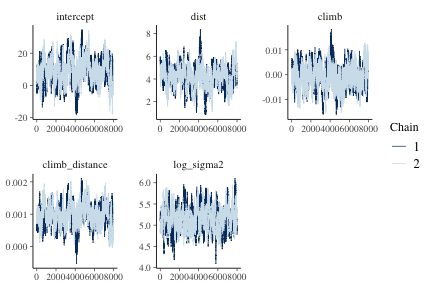
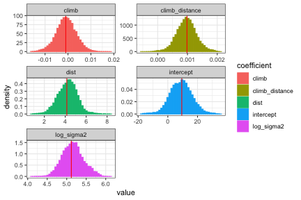

## Introduction

This vignette demonstrates fitting a linear regression model via Hamiltonian Monte Carlo (HMC) using the **hmclearn** package.

$$
\begin{aligned}
\mathbf{y} &= \mathbf{X}\boldsymbol\beta + \boldsymbol\epsilon \\
\boldsymbol\epsilon &\sim N(0, \sigma_\epsilon^2)
\end{aligned}
$$

HMC requires the specification of the log posterior to a proportional constant.  In addition, HMC uses the gradient of the log posterior to guide simulations.  The full derivations are provided here.

The vector of responses is  $\mathbf{y} = (y_1, ..., y_n)^T$. The covariate values for subject $i$ are $\mathbf{x}_i^T = (x_{i0}, ..., x_{iq})$ for $q$ covariates plus an intercept. We write the full design matrix as $\mathbf{X} = (\mathbf{x}_1^T, ..., \mathbf{x}_n^T)^T \in \mathbb{R}^{n\times(q+1)}$ for $n$ observations. The regression coefficients are a vector of length $q + 1$, $\boldsymbol\beta = (\beta_0, ..., \beta_q)^T$.  The error term for each subject is $\epsilon_i$. All error terms $\boldsymbol\epsilon = (\epsilon_1, ..., \epsilon_n)^T$ are assumed to be independent and normally distributed with mean zero and constant variance $\sigma_\epsilon^2$.

## Derive log posterior and gradient for HMC

We specify the likelihood function for linear regression

$$
f(\mathbf{y} | X, \boldsymbol\beta, \sigma_\epsilon^2) = \frac{1}{(2\pi\sigma_\epsilon^2)^{n/2}}\exp{\left(-\frac{1}{2\sigma_\epsilon^2} (\mathbf{y} - \mathbf{X}\boldsymbol\beta)^T(\mathbf{y}-\mathbf{X}\boldsymbol\beta) \right)}.
$$

The posterior is defined with priors for $\boldsymbol\beta$ and $\sigma_\epsilon^2$, such that

$$
\begin{aligned}
f(\boldsymbol\beta, \sigma_\epsilon^2| \mathbf{y}, \mathbf{X}) &\propto f(\mathbf{y} |\mathbf{X}, \boldsymbol\beta, \sigma_\epsilon^2) \pi(\boldsymbol\beta, \sigma_\epsilon^2), \\
&\propto f(\mathbf{y} | \mathbf{X}, \boldsymbol\beta, \sigma_\epsilon^2) \pi(\boldsymbol\beta) \pi(\sigma_\epsilon^2).
\end{aligned}
$$

We specify a multivariate normal prior for $\boldsymbol\beta$ and Inverse Gamma for $\sigma_\epsilon^2$.  Note that Inverse Gamma can be problematic in certain models where the variance is low (Gelman 2006).  The prior distributions in this example are

$$
\begin{aligned}
\pi(\boldsymbol\beta | \sigma_\beta^2) &\propto N(0, \sigma_\beta^2 \mathbf{I}), \\
\pi(\sigma_\epsilon^2 | a, b) &\sim IG(a, b).
\end{aligned}
$$

The pdf for $\sigma_\epsilon^2$ prior is

$$
f(\sigma_\epsilon^2) = \frac{b^a}{\Gamma(a)} (\sigma^2)^{-a-1} \exp\left(-\frac{b}{\sigma_\epsilon^2} \right).
$$

We perform a log-transformation of $\sigma^2$ to allow proposals across entire real number line.  For unconstrained HMC simulations, all parameters must support all real numbers. We provide details for the transformation of variable,

$$
\begin{aligned}
\gamma &= \log \sigma_\epsilon^2, \\
\sigma_\epsilon^2 &= g^{-1}(\gamma) = e^\gamma, \\
\pi_\gamma(\gamma | a, b) &= p_{\sigma_\epsilon^2}(g^{-1}(\gamma))\left\lvert \frac{d\sigma_\epsilon^2}{d\gamma} \right\rvert, \\
&= \frac{b^a}{\Gamma(a)}(e^\gamma)^{-a-1} \exp\left(-\frac{b}{\sigma^2} \right) \left\lvert e^\gamma  \right\rvert, \\
&= \frac{b^a}{\Gamma(a)}e^{-a\gamma}\exp\left(-\frac{b}{e^\gamma} \right) \\
&\propto e^{-a\gamma}\exp\left(-\frac{b}{e
^\gamma} \right), \\
\log \pi(\gamma | a, b) &\propto -a\gamma - be^{-\gamma}.
\end{aligned}
$$

The posterior and log posterior for linear regression, based on $\beta$ and $\gamma$, can now be derived.

$$
\begin{aligned}
f(\boldsymbol\beta, \gamma| \mathbf{y}, \mathbf{X}, \sigma_\beta^2, a, b) &\propto f(\mathbf{y} | \mathbf{X}, \boldsymbol\beta, \gamma) \pi(\boldsymbol\beta, \gamma | \sigma_\beta^2, a, b), \\
&\propto f(\mathbf{y}| \mathbf{X}, \boldsymbol\beta, \gamma) \pi(\boldsymbol\beta | \sigma_\beta^2) \pi(\gamma | a, b), \\
&\propto \frac{e^{-\gamma n/2}}{(2\pi)^{n/2}}\exp{\left(-\frac{e^{-\gamma}}{2} (\mathbf{y} - \mathbf{X}\boldsymbol\beta)^T(\mathbf{y}-\mathbf{X}\boldsymbol\beta) \right)} e^{-\frac{1}{2}\boldsymbol\beta^T\boldsymbol\beta / \sigma_\beta^2} e^{-a\gamma} e^{-b e^{-\gamma}},  \\
\log f(\boldsymbol\beta, \gamma | \mathbf{y}, \mathbf{X}, \sigma_\beta^2, a, b) &\propto -\frac{\gamma n}{2} -\frac{e^{-\gamma}}{2} (\mathbf{y} - \mathbf{X}\boldsymbol\beta)^T(\mathbf{y}-\mathbf{X}\boldsymbol\beta) - a\gamma - b e^{-\gamma}- \frac{\boldsymbol\beta^T \boldsymbol\beta}{2\sigma_\beta^2},   \\
&\propto -\left(\frac{n}{2} + a \right)\gamma  -\frac{e^{-\gamma}}{2} (\mathbf{y} - \mathbf{X}\boldsymbol\beta)^T(\mathbf{y}-\mathbf{X}\boldsymbol\beta)- b e^{-\gamma} - \frac{\boldsymbol\beta^T \boldsymbol\beta}{2\sigma_\beta^2}.
\end{aligned}
$$

Next, we derive the gradient of the log posterior

$$
\begin{aligned}
\log f(\boldsymbol\beta, \gamma | \mathbf{y}, \mathbf{X}, \sigma_\beta^2, a, b) &\propto -\frac{\gamma n}{2} -\frac{e^{-\gamma}}{2} (\mathbf{y} - \mathbf{X}\boldsymbol\beta)^T(\mathbf{y}-\mathbf{X}\boldsymbol\beta) - a\gamma - b e^{-\gamma} - \frac{\boldsymbol\beta^T \boldsymbol\beta}{2\sigma_\beta^2},  \\
&\propto -\left(\frac{n}{2} + a \right)\gamma  -\frac{e^{-\gamma}}{2} (y - X\beta)^T(y-X\beta)- b e^{-\gamma}- \frac{\boldsymbol\beta^T \boldsymbol\beta}{2\sigma_\beta^2},  \\
\nabla_{\boldsymbol\beta }\log f(\boldsymbol\beta, \gamma | \mathbf{y}, \mathbf{X}, \sigma_\beta^2, a, b) &\propto -\frac{e^{-\gamma}}{2}(-2)\mathbf{X}^T(\mathbf{y}-\mathbf{X}\boldsymbol\beta) - \boldsymbol\beta/\sigma_\beta^2, \\
&\propto e^{-\gamma} \mathbf{X}^T(\mathbf{y}-\mathbf{X}\boldsymbol\beta) - \boldsymbol\beta/\sigma_\beta^2, \\
\nabla_\gamma\log f(\beta, \gamma | y, \mathbf{X}, \sigma_\beta^2, a, b) &\propto -\left(\frac{n}{2} + a \right) + \frac{e^{-\gamma}}{2} (y - X\beta)^T(y-X\beta)+ b e^{-\gamma}.
\end{aligned}
$$

## Linear Regression Example Data


```r
library(hmclearn)
```

The user must define provide the design matrix directly for use in **hmclearn**.  Our first step is to load the data and store the design matrix $X$ and dependent variable vector $y$.

Load Scots Race data (Atkinson 1986, Venables and Ripley 2002) and display the first few rows of the design matrix $X$.  This example also appears in Agresti (2015), and we compare results to his.


```r
ScotsRaces <- MASS::hills

X <- cbind(1, as.matrix(ScotsRaces[, -which(colnames(ScotsRaces) == "time")]))

# add interaction
X <- cbind(X, X[, "dist"] * X[, "climb"])
colnames(X)[ncol(X)] <- "climb_distance"
colnames(X)[1] <- "intercept"

y <- ScotsRaces$time

head(X, 3)
#>              intercept dist climb climb_distance
#> Greenmantle          1  2.5   650           1625
#> Carnethy             1  6.0  2500          15000
#> Craig Dunain         1  6.0   900           5400
```

## Comparison model - Frequentist

To compare results, we first fit a standard linear model using the frequentist function *lm*. This formula for the linear model omits the automatic inclusion of the intercept. We code the formula in this way since our design matrix already includes the intercept.


```r
f <- lm(y ~ X-1)
summary(f)
#> 
#> Call:
#> lm(formula = y ~ X - 1)
#> 
#> Residuals:
#>     Min      1Q  Median      3Q     Max 
#> -25.994  -4.968  -2.220   2.381  56.115 
#> 
#> Coefficients:
#>                   Estimate Std. Error t value Pr(>|t|)    
#> Xintercept       9.3954374  6.8790233   1.366  0.18183    
#> Xdist            4.1489201  0.8352489   4.967 2.36e-05 ***
#> Xclimb          -0.0009710  0.0041648  -0.233  0.81718    
#> Xclimb_distance  0.0009831  0.0003070   3.203  0.00314 ** 
#> ---
#> Signif. codes:  0 '***' 0.001 '**' 0.01 '*' 0.05 '.' 0.1 ' ' 1
#> 
#> Residual standard error: 12.92 on 31 degrees of freedom
#> Multiple R-squared:  0.9744,	Adjusted R-squared:  0.9711 
#> F-statistic: 295.1 on 4 and 31 DF,  p-value: < 2.2e-16
```

Next, we store the parameter values from the Frequentist fit.


```r
beta.freq <- as.numeric(coefficients(f))
sigma2.freq <- sigma(f)^2
theta.freq <- c(beta.freq, log(sigma2.freq))
```

The functions for the log posterior and its gradient are coded in the *linear_posterior* and *g_linear_posterior* functions, respectively, in **hmclearn**. We use the default hyperparameters in these functions for $\sigma_\beta^2$, $a$, and $b$.

## Fit model using *hmc*

Next, we fit the linear regression model using HMC.  A vector of *tuning parameter* $\epsilon$ values are specified to align with the data.


```r
N <- 1e4

eps_vals <- c(1e-1, 1e-2, 1e-4, 5e-6, 3e-3)

set.seed(412)
t1.hmc <- Sys.time()
 f_hmc <- hmc(N=N, theta.init = rep(0, 5),
                    epsilon = eps_vals, L = 20,
                    logPOSTERIOR = linear_posterior,
                    glogPOSTERIOR = g_linear_posterior,
                    param=list(y = y, X=X),
                    varnames = c(colnames(X), "log_sigma2"),
                    parallel=FALSE, chains=2)
t2.hmc <- Sys.time()
t2.hmc - t1.hmc
#> Time difference of 33.60683 secs
```

## MCMC summary and diagnostics

The acceptance rate for each of the HMC chains is high for this simple example. More complex applications will often need lower acceptance rates (e.g. between 0.6 and 0.9) for optimal computational efficiency, particularly without an automated tuning algorithm such as NUTS (Hoffman, Gelman 2014).


```r
f_hmc$accept/N
#> [1] 0.9754 0.9739
```

The posterior quantiles are summarized after removing an initial *burnin* period. The $\hat{R}$ statistics are close to one, indicating that both HMC chains converged to the same distribution. The $\hat{R}$ statistics provide an indication of convergence. Values close to one indicate that the multiple MCMC chains converged to the same distribution, while values above 1.1 indicate possible convergence problems. All $\hat{R}$ values in our example are close to one.


```r
summary(f_hmc, burnin=2000, probs=c(0.025, 0.5, 0.975))
#> Summary of MCMC simulation
#>                         2.5%           50%        97.5%     rhat
#> intercept      -5.7142329771  8.9049258856 23.723775456 1.001586
#> dist            2.3501882118  4.2514043301  6.005448911 1.000097
#> climb          -0.0097779405 -0.0008269856  0.007966189 1.004726
#> climb_distance  0.0002976812  0.0009675666  0.001647897 1.002775
#> log_sigma2      4.6565425078  5.1499951245  5.726026622 1.002336
```

Trace plots provide a visual indication of stationarity.  These plots indicate that the MCMC chains are reasonably stationary.


```r
mcmc_trace(f_hmc, burnin=2000)
```



Histograms of the posterior distribution show that Bayesian parameter estimates align with frequentist estimates for this example.


```r
diagplots(f_hmc, comparison.theta=theta.freq, burnin=2000)
#> $histogram
```



## Source

A.C. Atkinson (1986) Comment: Aspects of diagnostic regression analysis. *Statistical Science* 1, 397–402.

## References

Venables, W. N. and Ripley, B. D. (2002) *Modern Applied Statistics with S*. Fourth edition. Springer.  ISBN 0-387-95457-0

Gelman, Andrew. (2006) "Prior distributions for variance parameters in hierarchical models (comment on article by Browne and Draper)." *Bayesian analysis* 1.3: 515-534.

Agresti, A. (2015). *Foundations of linear and generalized linear models*. John Wiley & Sons.  ISBN: 978-1-118-73003-4

Hoffman, M. D., & Gelman, A. (2014). The No-U-Turn sampler: adaptively setting path lengths in Hamiltonian Monte Carlo. *Journal of Machine Learning Research*, 15(1), 1593-1623.

Thomas, Samuel, and Wanzhu Tu. "Learning Hamiltonian Monte Carlo in R." arXiv preprint arXiv:2006.16194 (2020).

