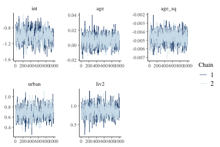
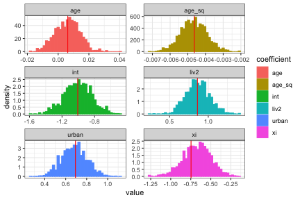
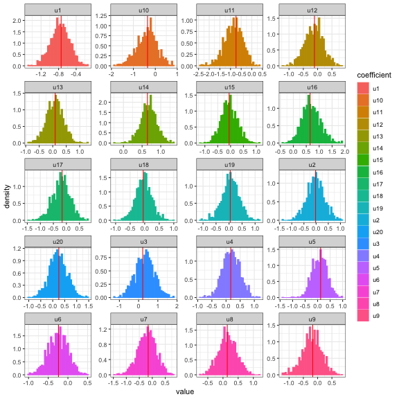
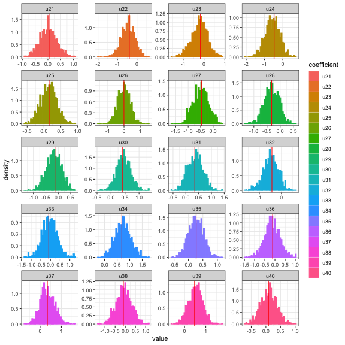
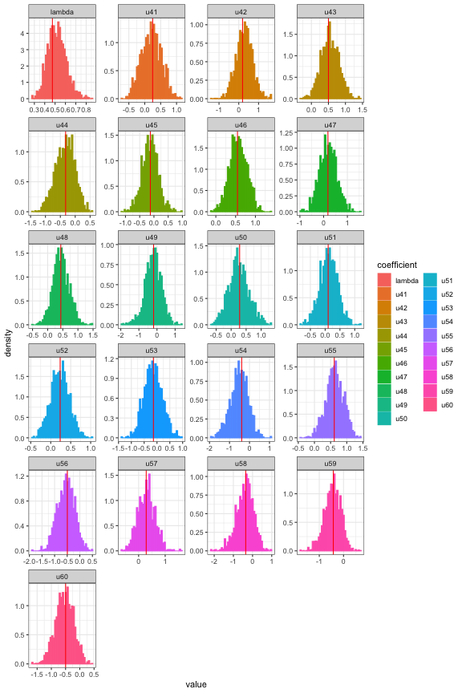

## Introduction

This vignette demonstrates fitting a Logistic mixed effects regression model via Hamiltonian Monte Carlo (HMC) using the **hmclearn** package.

For a mixed effects model with binary response, we let

$$
Pr(\mathbf{y} = \mathbf{1} | \mathbf{X}, \mathbf{Z}) = [1 + e^{-\mathbf{X}\boldsymbol\beta-\mathbf{Z} \mathbf{u} } ]^{-1},
$$
or

$$
\begin{aligned}
\text{logit}[P(\mathbf{y} = 1 | \mathbf{u})] &= \mathbf{X}\boldsymbol\beta + \mathbf{Z}\mathbf{u}, \\
\mathbf{u} &\sim N(0, \mathbf{G}).
\end{aligned}
$$


```r
library(hmclearn)
```

The response for each subject is a vector $\mathbf{y} = (\mathbf{y}_1, ..., \mathbf{y}_n)$ for $n$ subjects $i= 1, ..., n$.  Each subject has $d$ observations $\mathbf{y}_i = (y_{i1}, ..., y_{id})$ and we let $j = 1, ..., d$. The fixed effect design matrix is composed of matrices for each subject, $\mathbf{X} = (\mathbf{X}_1, ..., \mathbf{X}_n)$, and $\mathbf{X}_i \in \mathbb{R}^{d\times (q+1)}$ for the fixed effects parameters $\boldsymbol\beta = (\beta_0, ..., \beta_q)$. The full fixed effects design matrix is therefore $\mathbf{X} \in \mathbb{R}^{nd \times (q+1)}$.

For random effects, $\mathbf{Z} = \text{diag}(\mathbf{Z}_1, ..., \mathbf{Z}_n)$, with individual random effects matrices $\mathbf{Z}_i$ for each of the $i$ subjects. A random intercept model specifies $\mathbf{Z}_i$ as a column vector of ones where $\mathbf{Z}_i = \mathbf{z}_i = \mathbf{1}_d$. The full random effects design matrix $\mathbf{Z} \in \mathbb{R}^{nd\times n}$.  The parameterization for random effects is $\mathbf{u} = (\mathbf{u}_1, ..., \mathbf{u}_n)^T$ with vectors $\mathbf{u}_i$ for each subject. A random intercept model is somewhat simplified where $\mathbf{u}_i = u_i$ denotes a single random intercept parameter for each subject $i$, and $\mathbf{u} = (u_1, ..., u_n)^T$.

We set $\mathbf{u}$ as one of our priors, following a multivariate normal distribution, $\mathbf{u} \sim N(0, \mathbf{G})$. For our random intercept model, the specification of the covariance matrix $\mathbf{G}$ is expanded to facilitate efficient sampling using HMC.  We let $\mathbf{u} = \mathbf{G}^{1/2}\boldsymbol\tau$ where $\mathbf{G}^{1/2} = \lambda \mathbf{I}_n$. An additional parameter $\boldsymbol\tau = (\tau_1, ..., \tau_n)^T$ where each of these parameters is standard normal $\tau_i \sim N(0, 1)$. The full covariance matrix is then $\mathbf{G} = \lambda^2 \mathbf{I}_n \boldsymbol\tau$.

The parameterization approach for this model uses a strategy recommended by Betancourt, Girolami (2013) to facilitate more efficient sampling in HMC.

Further, we select a half-t family of distributions appropriate for hierarchical models per Gelman (2006).  This parameterization is well-behaved around 0, in contrast to inverse gamma, and provides flexibility for informed priors.

We select a parameterization of $\mathbf{G}$ such that the likelihood and its gradient can be derived for HMC.  To this end, we uses LDL decomposition of $\mathbf{G}$ to form a flexible parameterization that can easily handle restrictions (Chan, Jelizkov 2009).

$$
\begin{aligned}
\mathbf{u} &\sim N(0, \mathbf{G}),  \\
\mathbf{G} &= \mathbf{L} \mathbf{D} \mathbf{L}^T,  \\
&= \mathbf{L} \mathbf{D}^{1/2} \mathbf{D}^{1/2} \mathbf{L}^T. \\
\end{aligned}
$$

Let $\boldsymbol{\lambda} = (\lambda_1, ..., \lambda_p)$ denote the diagonal elements of $\mathbf{D}^{1/2}$ where $p$ indicates the number of random effect parameters, specified as *nrandom* in **hmclearn**. A future release of **hmclearn** will allow prior specification for the off-diagonal elements of $L$. For the current version, we let $L = I_{p}$.

$$
\mathbf{D}^{1/2} :=
\begin{pmatrix}
\lambda_1 & 0 & ... & 0 \\
0 & \lambda_2 & 0 ... & 0 \\
... & ... & ... & ... \\
0 & 0 & ... & \lambda_p
\end{pmatrix}, \quad
\mathbf{L} :=
\begin{pmatrix}
1 & 0 & 0 & ... & 0 \\
0 & 1 & 0 & ... & 0 \\
0 & 0 & 1 & ... & ... \\
... & ... & ... & ... & ... \\
0 & 0 & ... & ... & 1 \\
\end{pmatrix}.
$$

We set the prior for $\boldsymbol\beta$ as multivariate normal with variance $\sigma_\beta^2$, a hyperparameter set by the analyst. The priors for $\boldsymbol\lambda$ are half-t per Gelman (2006) on hierarchical models.

$$
\begin{aligned}
\pi(\boldsymbol\beta | \sigma_\beta^2) &\propto N(0, \sigma_\beta^2 \mathbf{I}), \\
\pi(\boldsymbol\lambda) &\sim  \left(1 + \frac{1}{\nu_\lambda}\left(\frac{\boldsymbol\lambda}{A_\lambda} \right)^2 \right)^{-(\nu+1)/2}.
\end{aligned}
$$

We want proposals of $\boldsymbol\lambda$ over the real number line.  Therfore we derive the distribution of the transformed parameter $\boldsymbol\xi$ based on a change of variable

$$
\begin{aligned}
\boldsymbol\xi &:= \log\boldsymbol\lambda,  \\
\boldsymbol\lambda &:= e^{\boldsymbol\xi}.
\end{aligned}
$$

We need to compute the Jacobian of the transformation

$$
\begin{aligned}
\pi_{\boldsymbol\xi}(\boldsymbol\xi) &= \pi_{\boldsymbol\xi}(g^{-1}(\boldsymbol\xi)) \left\lvert \frac{d\boldsymbol\lambda}{d\boldsymbol\xi}  \right\rvert, \\
&= \pi_{\boldsymbol\lambda} (e^{\boldsymbol\xi})\lvert e^{\boldsymbol\xi}\rvert, \\
&= \left(1 + \frac{1}{\nu_\xi} \frac{e^{2\boldsymbol\xi}}{A_{\xi}^2}\right)^{-\frac{\nu_{\xi}+1}{2}}e^{\boldsymbol\xi}, \\
\log \pi(\boldsymbol\xi) &\propto -\frac{\nu_{\xi}+1}{2}\log\left(1 + \frac{1}{\nu_{\xi}} \frac{e^{2\boldsymbol\xi}}{A_{\xi}^2}\right)+ \boldsymbol\xi.
\end{aligned}
$$

## Derive log posterior and gradient for HMC

First, we derive the likelihood for our logistic mixed effects regression model.

$$
\begin{aligned}
f(\mathbf{y}|\mathbf{X}, \mathbf{Z}, \boldsymbol\beta, \mathbf{u}) &= \prod_{i=1}^n \prod_{j=1}^d p(y_{ij})^{y_{ij}}(1-p(y_{ij}))^{1-y_{ij}}, \\
&= \prod_{i=1}^n \prod_{j=1}^d \left(\frac{1}{1 + e^{-\mathbf{x}_{ij}^T\boldsymbol\beta - \mathbf{z}_{ij}^T\mathbf{u}_i}} \right)^{y_{ij}}  \left( \frac{e^{-\mathbf{x}_{ij}^T\boldsymbol\beta - \mathbf{z}_{ij}^T\mathbf{u}_i}}{1+e^{-\mathbf{x}_{ij}^T\boldsymbol\beta - \mathbf{z}_{ij}^T\mathbf{u}_i}}  \right)^{1-y_{ij}},
 \\
\log f(\mathbf{y}|\mathbf{X}, \mathbf{Z}, \boldsymbol\beta, \mathbf{u}) &= \sum_{i=1}^n \sum_{j=1}^d -y_{ij} \log\left(1+e^{-\mathbf{x}_{ij}^T\boldsymbol\beta - \mathbf{z}_{ij}^T\mathbf{u}_i} \right) + (1 - y_{ij})\log e^{-\mathbf{x}_{ij}^T\boldsymbol\beta - \mathbf{z}_{ij}^T\mathbf{u}_i} - (1 - y_{ij})\log\left(1+e^{-\mathbf{x}_{ij}^T\boldsymbol\beta - \mathbf{z}_{ij}^T\mathbf{u}_i} \right), \\
&= \sum_{i=1}^n\sum_{j=1}^d -y_{ij} \log\left(1+e^{-\mathbf{x}_{ij}^T\boldsymbol\beta - \mathbf{z}_{ij}\mathbf{u}_i} \right) -\mathbf{x}_{ij}\boldsymbol\beta -\mathbf{z}_{ij}\mathbf{u}_i + y_{ij}\mathbf{x}_{ij}^T\boldsymbol\beta + y_{ij}\mathbf{z}_{ij}^T\mathbf{u}_i - \\
&\qquad \log\left(1+e^{-\mathbf{x}_{ij}^T\boldsymbol\beta - \mathbf{z}_{ij}^T\mathbf{u}_i} \right) + y_{ij} \log\left(1+e^{-\mathbf{x}_{ij}^T\boldsymbol\beta - \mathbf{z}_{ij}^T\mathbf{u}_i} \right), \\
&= \sum_{i=1}^n \sum_{j=1}^d -\mathbf{x}_{ij}^T\boldsymbol\beta - \mathbf{z}_{ij}^T\mathbf{u}_i + y_{ij}\mathbf{x}_{ij}^T\boldsymbol\beta + y_{ij}\mathbf{z}_{ij}^T\mathbf{u}_i - \log\left(1+e^{-\mathbf{x}_{ij}^T\boldsymbol\beta - \mathbf{z}_{ij}^T\mathbf{u}_i} \right), \\
&= \sum_{i=1}^n \sum_{j=1}^d (y_{ij}-1 )(\mathbf{x}_{ij}^T\boldsymbol\beta + \mathbf{z}_{ij}^T\mathbf{u}_i) - \log\left(1+e^{-\mathbf{x}_{ij}^T\boldsymbol\beta - \mathbf{z}_{ij}^T\mathbf{u}_i} \right), \\
&= (\mathbf{y} - \mathbf{1}_{nd})^T (\mathbf{X}\boldsymbol\beta + \mathbf{Z}\mathbf{u}) - \mathbf{1}_{nd}\log (1 + e^{-\mathbf{X}\boldsymbol\beta - \mathbf{Z}\mathbf{u}}).
\end{aligned}
$$

Additional notation is added to simplify the log likelihood, log posterior, and gradient formulations, $\widetilde{\mathbf{D}}^{1/2} = \mathbf{I}_n \otimes \mathbf{D}^{1/2}$. Note that $\widetilde{\mathbf{D}}^{1/2} = \left(\widetilde{\mathbf{D}}^{1/2}\right ) ^T$ due to symmetry.

We write the re-parameterized log likelihood,

$$
\begin{aligned}
\log f(\mathbf{y}|\mathbf{X}, \mathbf{Z}, \boldsymbol\beta, \xi, \boldsymbol\tau) &= (\mathbf{y} - \mathbf{1}_{nd})^T (\mathbf{X}\boldsymbol\beta + \mathbf{Z}\widetilde{\mathbf{D}}^{1/2}\boldsymbol\tau) - \mathbf{1}_{nd}\log (1 + e^{-\mathbf{X}\boldsymbol\beta - \mathbf{Z}\widetilde{\mathbf{D}}^{1/2}\boldsymbol\tau}).
\end{aligned}
$$

Next, we express the log priors that we use with transformations, omitting constants. Note that the log densities of the priors with log densities include an additive term for the transformed distribution (i.e. $\xi$ and $\gamma$),

$$
\begin{aligned}
\log \pi(\boldsymbol\beta | \sigma_\beta^2) &\propto -\frac{\boldsymbol\beta^T \boldsymbol\beta}{2\sigma_\beta^2}, \\
\log \pi(\boldsymbol\xi | \nu_\xi, A_\xi) &\propto -\frac{\nu_\xi + 1}{2} \log \left( 1 + \frac{1}{\nu_\xi} \left(\frac{e^\boldsymbol\xi}{A_\xi} \right)^2 \right) + \boldsymbol\xi, \\
\log \pi(\boldsymbol\tau) &\propto -\frac{1}{2}\boldsymbol\tau^T \boldsymbol\tau.
\end{aligned}
$$

The full log posterior with transformed variables is the log likelihood plus the log prior. We develop the log posterior omitting constants,

$$
\begin{aligned}
\log f(\boldsymbol\beta, \xi, \boldsymbol\tau|\mathbf{y}, \mathbf{X}, \mathbf{Z}) &\propto \log f(\mathbf{y}|\mathbf{X}, \mathbf{Z}, \boldsymbol\beta, \xi, \boldsymbol\tau) + \log f(\boldsymbol\beta, \xi, \boldsymbol\tau | \sigma_\beta^2, \nu_\xi, A_\xi), \\
&\propto \log f(\mathbf{y}|\mathbf{X}, \mathbf{Z}, \boldsymbol\beta, \xi, \boldsymbol\tau) + \log f(\boldsymbol\beta | \sigma_\beta^2) + \log f(\xi | \nu_\xi, A_\xi) + \log f(\boldsymbol\tau), \\
&\propto  (\mathbf{y} - \mathbf{1}_{nd})^T (\mathbf{X}\boldsymbol\beta + \mathbf{Z}\widetilde{\mathbf{D}}^{1/2}\boldsymbol\tau) - \mathbf{1}_{nd}^T\log (1 + e^{-\mathbf{X}\boldsymbol\beta - \mathbf{Z}\widetilde{\mathbf{D}}^{1/2}\boldsymbol\tau})  - \\ &\qquad \frac{\boldsymbol\beta^T\boldsymbol\beta}{2\sigma_\beta^2}-\frac{\nu_\xi + 1}{2} \log \left( 1 + \frac{1}{\nu_\xi} \left(\frac{e^\xi}{A_\xi} \right)^2 \right) + \xi-\frac{1}{2}\boldsymbol\tau^T \boldsymbol\tau.
\end{aligned}
$$


Next we derive the gradient of the log posterior, comprised of partial derivatives for each of our parameters.

We omit $\mathbf{L}$ since this is currently defined as the identity matrix.

We derive the partial derivative of $\boldsymbol\beta$,

$$
\begin{aligned}
\nabla_\beta \log f(\boldsymbol\beta, \xi, \boldsymbol\tau | \mathbf{y}, \mathbf{X}, \mathbf{Z}, \sigma_\beta^2, \nu_\xi, A_\xi) &\propto \mathbf{X}^T (\mathbf{y} - \mathbf{1}_{nd})+ \mathbf{X}^T \left[ 1 + e^{-\mathbf{X}\boldsymbol\beta - \mathbf{Z}\widetilde{\mathbf{D}}^{1/2}\boldsymbol\tau } \right]^{-1}e^{-\mathbf{X}\boldsymbol\beta-\mathbf{Z}\widetilde{\mathbf{D}}^{1/2}\boldsymbol\tau} - \boldsymbol\beta / \sigma_\beta^2, \\
&\propto \mathbf{X}^T(\mathbf{y} - \mathbf{1}_{nd}) + \mathbf{X}^T \left(\frac{e^{-\mathbf{X}\boldsymbol\beta-\mathbf{Z}\widetilde{\mathbf{D}}^{1/2}\boldsymbol\tau}}{1 + e^{-\mathbf{X}\boldsymbol\beta-\mathbf{Z}\widetilde{\mathbf{D}}^{1/2}\boldsymbol\tau}} \right) - \boldsymbol\beta / \sigma_\beta^2, \\
&\propto  \mathbf{X}^T(\mathbf{y} - \mathbf{1}_{nd}) + \mathbf{X}^T \left(\frac{1}{1 + e^{\mathbf{X}\boldsymbol\beta+\mathbf{Z}\widetilde{\mathbf{D}}^{1/2}\boldsymbol\tau}} \right) - \boldsymbol\beta / \sigma_\beta^2,  \\
&\propto \mathbf{X}^T \left( \mathbf{y} - \mathbf{1}_{nd} +\frac{1}{1 + e^{\mathbf{X}\boldsymbol\beta+\mathbf{Z}\widetilde{\mathbf{D}}^{1/2}\boldsymbol\tau}} \right) - \boldsymbol\beta / \sigma_\beta^2.
\end{aligned}
$$

Next we derive the partial derivative of each parameter $\xi_1, ..., \xi_p$ where $jj = 1, ..., p$,

$$
\begin{aligned}
\nabla_{\xi_{jj} }\log f(\boldsymbol\beta, \xi_{jj}, \boldsymbol\tau| \mathbf{y}, \mathbf{X}, \mathbf{Z}, \sigma_\beta^2, \nu_\xi, A_\xi)
&\propto e^{\xi_{jj}} \boldsymbol\tau^T \mathbf{Z}^T (\mathbf{y} - \mathbf{1}_{nd})^T + e^{\xi_{jj}}\boldsymbol\tau^T\mathbf{Z}^T\left[1 + e^{-\mathbf{X}\boldsymbol\beta - e^{\xi_{jj}}\mathbf{Z}\boldsymbol\tau} \right ]^{-1} e^{-\mathbf{X}\boldsymbol\beta - e^{\xi_{jj}}\mathbf{Z}\boldsymbol\beta}
- \frac{\nu_\xi + 1}{1 + \nu_\xi A_\xi^2 e^{-2\xi_{jj}}} + 1, \\
&\propto e^{\xi_{jj}} \boldsymbol\tau^T \mathbf{Z}^T(\mathbf{y} - \mathbf{1}_{nd})^T + e^{\xi_{jj}}\boldsymbol\tau^T\mathbf{Z}^T \left ( \frac{e^{-\mathbf{X}\boldsymbol\beta - e^{\xi_{jj}}\mathbf{Z}\boldsymbol\tau} }{1 + e^{-\mathbf{X}\boldsymbol\beta - e^{\xi_{jj}}\mathbf{Z}\boldsymbol\tau}}  \right)
- \frac{\nu_\xi + 1}{1 + \nu_\xi A_\xi^2 e^{-2\xi_{jj}}} + 1, \\
&\propto e^{\xi_{jj}}\boldsymbol\tau^T \mathbf{Z}^T \left(\mathbf{y} - \mathbf{1}_{nd} +  \frac{1 }{1 + e^{\mathbf{X}\boldsymbol\beta + e^{\xi_{jj}}\mathbf{Z}\boldsymbol\tau}} \right )
- \frac{\nu_\xi + 1}{1 + \nu_\xi A_\xi^2 e^{-2\xi_{jj}}} + 1.
\end{aligned}
$$

Next, we derive the partial derivative of $\boldsymbol\tau$,

$$
\begin{aligned}
\nabla_\tau \log f(\boldsymbol\beta, \xi, \boldsymbol\tau | \mathbf{y}, \mathbf{X}, \mathbf{Z}, \sigma_\beta^2, \nu_\xi, A_\xi)
&\propto \widetilde{\mathbf{D}}^{1/2}\mathbf{Z}^T (\mathbf{y} - \mathbf{1}_{nd}) + \widetilde{\mathbf{D}}^{1/2}\mathbf{Z}^T \left(\frac{e^{-\mathbf{X}\boldsymbol\beta-\mathbf{Z}\widetilde{\mathbf{D}}^{1/2}\boldsymbol\tau}}{1 + e^{-\mathbf{X}\boldsymbol\beta-\mathbf{Z}\widetilde{\mathbf{D}}^{1/2}\boldsymbol\tau}} \right)  - \tau \\
&\propto \widetilde{\mathbf{D}}^{1/2}\mathbf{Z}^T \left(\mathbf{y} - \mathbf{1}_{nd} + \frac{1}{1 + e^{\mathbf{X}\boldsymbol\beta + \mathbf{Z}\widetilde{\mathbf{D}}^{1/2}\boldsymbol\tau}} \right) - \tau .
\end{aligned}
$$

The gradient of full log posterior can now be specified,

$$
\begin{aligned}
\nabla_\beta \log f(\boldsymbol\beta, \xi, \boldsymbol\tau, \gamma | \mathbf{y}, \mathbf{X}, \mathbf{Z})
&\propto \mathbf{X}^T \left( \mathbf{y} - \mathbf{1}_{nd} +\frac{1}{1 + e^{\mathbf{X}\boldsymbol\beta+\mathbf{Z}\widetilde{\mathbf{D}}^{1/2}\boldsymbol\tau}} \right) - \boldsymbol\beta / \sigma_\beta^2, \\
\nabla_{\xi_{jj}} \log f(\boldsymbol\beta, \xi, \boldsymbol\tau, \gamma | \mathbf{y}, \mathbf{X}, \mathbf{Z})
&\propto e^{\xi_{jj}}\mathbf{Z}\boldsymbol\tau \left(\mathbf{y} - \mathbf{1}_{nd} +  \frac{1 }{1 + e^{\mathbf{X}\boldsymbol\beta + e^{\xi_{jj}}\mathbf{Z}\boldsymbol\tau}} \right )
- \frac{\nu_\xi + 1}{1 + \nu_\xi A_\xi^2 e^{-2\xi_{jj}}} + 1,\quad \forall (\xi_1, ..., \xi_p) \in \boldsymbol\xi \\
\nabla_\tau \log f(\boldsymbol\beta, \xi, \boldsymbol\tau, \gamma | \mathbf{y}, \mathbf{X}, \mathbf{Z}) &\propto \widetilde{\mathbf{D}}^{1/2}\mathbf{Z}^T \left(\mathbf{y} - \mathbf{1}_{nd} + \frac{1}{1 + e^{\mathbf{X}\boldsymbol\beta + \mathbf{Z}\widetilde{\mathbf{D}}^{1/2}\boldsymbol\tau}} \right) - \tau.
\end{aligned}
$$

Note that a random intercept model only has a single $\xi$ parameter, which simplifies the log posterior and gradient formulations. For a random intercept model, $\widetilde{\mathbf{D}}^{1/2} =  e^{\xi}\mathbf{I}_n$.

## Logistic mixed effects model example data

The user must define provide the design matrix directly for use in **hmclearn**.  Our first step is to load the data and store the fixed effect design matrix $\mathbf{X}$, random effects design matrix $\mathbf{Z}$, and dependent variable vector $y$.

We load drug Contraception data (Bates, et. al. 2014) and create the design matrices $\mathbf{X}$ and $\mathbf{Z}$ and dependent vector $\mathbf{y}$.  For this model, the random effects design matrix $\mathbf{Z}$ is specified for a random intercept model.


```r
Contraception <- mlmRev::Contraception

Contraception$liv2 <- ifelse(Contraception$livch == "0", 0, 1)

##########
# block diagonal
Zi.lst <- split(rep(1, nrow(Contraception)), Contraception$district)
Zi.lst <- lapply(Zi.lst, as.matrix)
Z <- Matrix::bdiag(Zi.lst)
Z <- as.matrix(Z)

urban <- ifelse(Contraception$urban == "Y", 1, 0)

X <- cbind(1, Contraception$age, Contraception$age^2, urban, Contraception$liv2)
colnames(X) <- c("int", "age", "age_sq", "urban", "liv2")
y <- ifelse(Contraception$use == "Y", 1, 0)
```

## QR decomposition of design matrix

To facilitate a more efficient fitting of the model, we apply QR decomposition to the fixed effects design matrix $\mathbf{X}$.

Let $\widetilde{\boldsymbol\beta} = R^*\boldsymbol\beta$, where $\widetilde{\boldsymbol\beta}$ is the transformed vector of $\boldsymbol\beta$.  The HMC estimates $\widetilde{\boldsymbol\beta}$, from which we can use the deterministic formula to determine $\boldsymbol\beta$.

$$
\begin{aligned}
\mathbf{X} &= \mathbf{Q}^* \mathbf{R}^*, \quad \mathbf{Q}^* = \mathbf{Q} \cdot \sqrt{nd-1}, \quad \mathbf{R}^* = \frac{1}{\sqrt{nd-1}}\mathbf{R}, \\
\mathbf{X}\boldsymbol\beta &= \mathbf{Q}^* \mathbf{R}^* \boldsymbol\beta \\
\boldsymbol\beta &= \mathbf{R}^{*^{-1}}\widetilde{\boldsymbol\beta}, \quad \widetilde{\boldsymbol\beta} = \mathbf{R}^*\boldsymbol\beta
\end{aligned}
$$

We use the *qr* function from base **R** for our parameter transformation,


```r
xqr <- qr(X)
Q <- qr.Q(xqr)
R <- qr.R(xqr)

n <- nrow(X)
X2 <- Q * sqrt(n-1)
Rstar <- R / sqrt(n-1)
Rstar_inv <- solve(Rstar)
colnames(X2) <- c("int", "age", "age_sq", "urban", "liv2")
```

We could also apply QR decomposition to $\mathbf{Z}$, but this is not necessary for a random intercept model where all elements of $\mathbf{Z}$ are 0 or 1.

## Fit model using *hmc*

Next, we fit the linear mixed effects regression model using HMC.  A vector of *tuning parameter* $\epsilon$ values are specified to align with the data. The hyperparameters for $\nu_\xi$ and $A_\xi$ are set to defaults in **hmclearn** (Gelman 2006). The hyperparameter $\sigma_\beta^2$ is set lower than the default based on the dependent variable variance for this hierarchical model.


```r
N <- 2e3

set.seed(412)
initvals<- c(rep(0, 5), # fixed effects
                rep(0, 60), # random intercepts
                0) # variance of random intercepts

vnames <- c(colnames(X),
            paste0("tau_int", 1:60),
            "xi")

epsvals <- c(5e-2, rep(1e-2, 4), rep(5e-2, 61))

t1.hmc <- Sys.time()
f_hmc <- hmc(N = N, theta.init = initvals,
             epsilon = epsvals, L = 10,
             logPOSTERIOR = glmm_bin_posterior,
             glogPOSTERIOR = g_glmm_bin_posterior,
             varnames = vnames,
             parallel=FALSE, chains=2,
             param=list(y = y, X=X2, Z=Z, n=60, nrandom=1, sig2beta=5,
                        nuxi=1, Axi=25)  )


t2.hmc <- Sys.time()
t2.hmc - t1.hmc
#> Time difference of 16.14619 mins
```

The acceptance ratio for each of the HMC chains is sufficiently high for an efficient simulation.


```r
f_hmc$accept/N
#> [1] 0.670 0.672
```

Since we used QR decomposition to transform $\beta$ prior to fitting via HMC, we need to reverse the transformation to obtain the original parameter scale.


```r
# restore beta from Rstar in QR decomposition
calc_beta <- function(beta_tilde_param, Rstarinv) {
  as.numeric(Rstarinv %*% beta_tilde_param)
}

# reverse qr decomposition
f_hmc2 <- f_hmc
f_hmc2$thetaCombined <- lapply(f_hmc$thetaCombined, function(xx) {
  xx[, 1:5] <- t(apply(xx[, 1:5], 1, calc_beta, Rstarinv=Rstar_inv))
  xx
})
```

The posterior quantiles are summarized after removing an initial *burnin* period. The $\hat{R}$ statistics are close to one, indicating that both HMC chains converged to the same distribution. The $\hat{R}$ statistics provide an indication of convergence. Values close to one indicate that the multiple MCMC chains converged to the same distribution, while values above 1.1 indicate possible convergence problems. All $\hat{R}$ values in our example are close to one.


```r
summary(f_hmc2, burnin=1000, probs=c(0.025, 0.5, 0.975))
#> Summary of MCMC simulation
#>                   2.5%          50%        97.5%      rhat
#> int       -1.347499845 -1.002604446 -0.659497972 1.0014634
#> age       -0.009255767  0.006563724  0.020626589 1.0003654
#> age_sq    -0.006148684 -0.004683696 -0.003223872 1.0000839
#> urban      0.452351900  0.683275458  0.929803088 1.0076632
#> liv2       0.572722550  0.862870463  1.179121304 0.9997327
#> tau_int1  -2.465594898 -1.504566068 -0.660800597 1.0021200
#> tau_int2  -1.405244265 -0.046077600  1.353882998 0.9995182
#> tau_int3  -1.168076289  0.654959461  2.470604063 1.0133501
#> tau_int4  -0.784816167  0.369202243  1.513985214 0.9998724
#> tau_int5  -0.928682332  0.183618830  1.251809351 1.0080292
#> tau_int6  -1.481844791 -0.476888752  0.431850829 0.9995249
#> tau_int7  -1.747265505 -0.370917817  0.905435106 1.0076276
#> tau_int8  -0.854870796  0.292412315  1.482049428 1.0110102
#> tau_int9  -1.644541148 -0.378372534  0.913598514 1.0005747
#> tau_int10 -2.491775084 -0.682888192  0.954067631 1.0043927
#> tau_int11 -3.182466810 -1.658293490 -0.215434474 1.0022619
#> tau_int12 -1.600677101 -0.231618403  0.975786439 1.0017680
#> tau_int13 -1.170293314  0.169942826  1.320548092 1.0056639
#> tau_int14  0.486206193  1.315717615  2.241188249 1.0000029
#> tau_int15 -1.325409211 -0.120115440  1.102520071 1.0000940
#> tau_int16  0.074031338  1.309742660  2.663588823 1.0212303
#> tau_int17 -1.744419658 -0.351410830  0.881922589 1.0369249
#> tau_int18 -1.157279994 -0.065710778  1.011665802 1.0059568
#> tau_int19 -1.245115805  0.122116020  1.394560353 1.0158353
#> tau_int20 -1.027153714  0.426563713  1.849936129 1.0071624
#> tau_int21 -1.254942685  0.017976116  1.351423801 1.0192542
#> tau_int22 -2.332778090 -0.888691670  0.431605057 0.9998864
#> tau_int23 -2.000875433 -0.385289018  1.042722201 1.0026830
#> tau_int24 -2.646888057 -1.094847369  0.434614968 1.0117203
#> tau_int25 -0.667098400  0.277855404  1.127194544 0.9995049
#> tau_int26 -1.445290053  0.002781515  1.478335030 1.0561882
#> tau_int27 -2.132949357 -0.941302524  0.196168094 1.0019260
#> tau_int28 -1.734535718 -0.632972869  0.451512898 1.0019482
#> tau_int29 -1.569143502 -0.345303107  0.857115138 1.0011194
#> tau_int30 -0.131177086  0.875944519  1.882620898 1.0001374
#> tau_int31 -0.377730313  0.733064073  1.872115600 1.0141730
#> tau_int32 -2.258770246 -0.946487116  0.344841171 0.9995009
#> tau_int33 -1.574454654 -0.093608793  1.469875984 1.0019248
#> tau_int34  0.232098236  1.403767991  2.698852531 1.0184362
#> tau_int35 -0.477469395  0.513052067  1.514391502 0.9995147
#> tau_int36 -1.811149118 -0.297759332  1.178609170 1.0004970
#> tau_int37 -0.652864004  0.633495509  1.949085951 1.0026299
#> tau_int38 -1.575129436 -0.124136610  1.308530565 1.0231211
#> tau_int39 -0.303975919  1.037111743  2.273527703 1.0011847
#> tau_int40 -0.819018408  0.223307506  1.206773302 0.9997188
#> tau_int41 -0.757190334  0.427436139  1.556769074 0.9998307
#> tau_int42 -1.119880954  0.573428964  2.067500829 1.0195341
#> tau_int43  0.067577505  1.075004927  2.100332841 1.0016600
#> tau_int44 -1.894670996 -0.613922594  0.507643758 1.0057337
#> tau_int45 -1.414879962 -0.245333852  0.919593280 1.0018127
#> tau_int46  0.251684442  1.101175417  2.027513018 1.0094651
#> tau_int47 -1.007326126  0.377783628  1.784483404 1.0095375
#> tau_int48 -0.144092330  0.862074276  1.879188549 1.0107926
#> tau_int49 -2.130213651 -0.376494856  1.278222364 1.0118307
#> tau_int50 -0.827109771  0.472012275  1.807589669 0.9998834
#> tau_int51 -0.911076928  0.229237417  1.434753593 1.0006495
#> tau_int52 -0.433086014  0.453052678  1.325939296 1.0033275
#> tau_int53 -1.615030500 -0.315416767  1.109049230 1.0003612
#> tau_int54 -2.532241593 -0.956410434  0.605607306 0.9997552
#> tau_int55  0.156492872  1.202533184  2.291453242 0.9995593
#> tau_int56 -2.350742836 -1.025277907  0.234839832 0.9996233
#> tau_int57 -0.653381781  0.583648022  1.781793202 1.0052080
#> tau_int58 -2.448971701 -0.709517372  0.857475449 1.0001395
#> tau_int59 -2.231796487 -0.838218291  0.315858751 1.0011856
#> tau_int60 -2.319355056 -1.042270086  0.124104647 0.9997774
#> xi        -1.033553459 -0.662905154 -0.343340191 1.0022953
```

We create trace plots on the transformed simulation data.


```r
mcmc_trace(f_hmc2, burnin=1000, pars=colnames(X))
```



## Comparison model - Frequentist

To compare results, we first fit a logistic mixed effects model using the frequentist package **lme4** (Bates et. al. 2015).


```r
library(lme4)

fm1 <- glmer(use ~ age + I(age^2) + urban + liv2 + (1 | district),
           data=Contraception, family=binomial,
           control=glmerControl(optCtrl=list(maxfun=20000)))
#> Warning in checkConv(attr(opt, "derivs"), opt$par, ctrl = control$checkConv, : Model is nearly unidentifiable: very large eigenvalue
#>  - Rescale variables?
summary(fm1)
#> Generalized linear mixed model fit by maximum likelihood
#>   (Laplace Approximation) [glmerMod]
#>  Family: binomial  ( logit )
#> Formula: use ~ age + I(age^2) + urban + liv2 + (1 | district)
#>    Data: Contraception
#> Control: glmerControl(optCtrl = list(maxfun = 20000))
#> 
#>      AIC      BIC   logLik deviance df.resid 
#>   2385.2   2418.6  -1186.6   2373.2     1928 
#> 
#> Scaled residuals: 
#>     Min      1Q  Median      3Q     Max 
#> -1.8151 -0.7620 -0.4619  0.9518  3.1033 
#> 
#> Random effects:
#>  Groups   Name        Variance Std.Dev.
#>  district (Intercept) 0.2247   0.474   
#> Number of obs: 1934, groups:  district, 60
#> 
#> Fixed effects:
#>               Estimate Std. Error z value Pr(>|z|)    
#> (Intercept) -1.0063737  0.1691107  -5.951 2.67e-09 ***
#> age          0.0062561  0.0078848   0.793    0.428    
#> I(age^2)    -0.0046353  0.0007207  -6.432 1.26e-10 ***
#> urbanY       0.6929220  0.1206566   5.743 9.31e-09 ***
#> liv2         0.8603821  0.1483014   5.802 6.57e-09 ***
#> ---
#> Signif. codes:  0 '***' 0.001 '**' 0.01 '*' 0.05 '.' 0.1 ' ' 1
#> 
#> Correlation of Fixed Effects:
#>          (Intr) age    I(g^2) urbanY
#> age       0.529                     
#> I(age^2) -0.533 -0.506              
#> urbanY   -0.259 -0.032  0.020       
#> liv2     -0.801 -0.565  0.345  0.094
#> convergence code: 0
#> Model is nearly unidentifiable: very large eigenvalue
#>  - Rescale variables?
```


```r

freqvals <- c(as.numeric(fixef(fm1)),
              as.numeric(ranef(fm1)$district[, 1]),
              log(sqrt(as.numeric(VarCorr(fm1)[1]))))
```


Histograms of the posterior distribution show that Bayesian parameter estimates align with frequentist estimates.  The *cols* parameter specifies the parameters to be displayed in *diagplots*, based on the order provided to the *hmc* function.


```r
diagplots(f_hmc2, burnin=1000,
          comparison.theta=c(freqvals[1:ncol(X)],
                             freqvals[length(freqvals)]),
          cols=c(1:ncol(X), length(initvals)))
#> $histogram
```




We also compare the random effects parameter estimates with **lme4**. We apply the linear transformation back to $\mathbf{u}$ for comparison.


```r
u.freq <- ranef(fm1)$district[, 1]
lambda.freq <- sqrt(VarCorr(fm1)$district[1])

# transform parameters back to original scale
f_hmc$thetaCombined <- lapply(f_hmc$thetaCombined, function(xx) {
  tau_mx <- as.matrix(xx[, grepl("tau", colnames(xx))])
  u_mx <- tau_mx * exp(xx[, "xi"])
  u_df <- as.data.frame(u_mx)
  colnames(u_df) <- paste0("u", 1:ncol(u_df))
  xx <- cbind(xx, u_df, exp(xx[, "xi"]))
  colnames(xx)[ncol(xx)] <- "lambda"
  xx
})
```

Since we have 60 random effect parameters plus $\lambda$, we split the plots into more manageable chunks. The random effects parameters align with frequentist estimates.


```r
# histograms with lines for frequentist estimates
ucols <- which(grepl("^[u](?:[1-9]|0[1-9]|1[0-9]|20)$",
                     colnames(f_hmc$thetaCombined[[1]])))
lambdacol <- which(grepl("^lambda", colnames(f_hmc$thetaCombined[[1]])))
diagplots(f_hmc, burnin=1000,
          comparison.theta = u.freq[1:20], cols = ucols)
#> $histogram
```




```r
# histograms with lines for frequentist estimates
ucols <- which(grepl("^[u](?:2[1-9]|3[0-9]|40)$",
                     colnames(f_hmc$thetaCombined[[1]])))
lambdacol <- which(grepl("^lambda", colnames(f_hmc$thetaCombined[[1]])))
diagplots(f_hmc, burnin=1000,
          comparison.theta = u.freq[21:40], cols = ucols)
#> $histogram
```




```r
# histograms with lines for frequentist estimates
ucols <- which(grepl("^[u](?:4[1-9]|5[0-9]|60)$",
                     colnames(f_hmc$thetaCombined[[1]])))
lambdacol <- which(grepl("^lambda", colnames(f_hmc$thetaCombined[[1]])))
diagplots(f_hmc, burnin=1000,
          comparison.theta = c(u.freq[41:60], lambda.freq), cols = c(ucols, lambdacol))
#> $histogram
```




## Source

Steele, F., Diamond, I. And Amin, S. (1996). Immunization uptake in rural Bangladesh: a multilevel analysis. *Journal of the Royal Statistical Society*, Series A (159): 289-299.

\url{http://www.bristol.ac.uk/cmm/learning/mmsoftware/data-rev.html}

## References

Bates, D., M&auml;chler, M., Bolker, B., & Walker, S. (2015). Fitting linear mixed-effects models using lme4. *Journal of Statistical Software* 67(1)

Bates, D., M&auml;chler, M., & Bolker, B. (2014). mlmRev: Examples from multilevel modelling software review. *R package version, 1*.

Agresti, A. (2015). *Foundations of linear and generalized linear models*. John Wiley & Sons.  ISBN: 978-1-118-73003-4

Thomas, Samuel, and Wanzhu Tu. "Learning Hamiltonian Monte Carlo in R." arXiv preprint arXiv:2006.16194 (2020).
