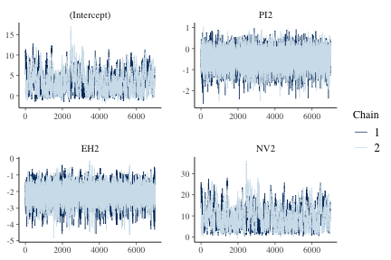
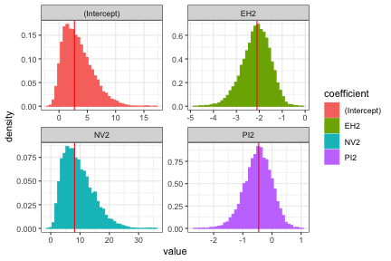

## Introduction

This vignette demonstrates fitting a logistic regression model via Hamiltonian Monte Carlo (HMC) using the **hmclearn** package.


```r
library(hmclearn)
library(MCMCpack)
```

For binary response, we let

$$
p = Pr(\mathbf{y} = 1 | \mathbf{X}) = [1 + e^{-\mathbf{X}\boldsymbol\beta}]^{-1}.
$$

The vector of responses is  $\mathbf{y} = (y_1, ..., y_n)^T$. The covariate values for subject $i$ are $\mathbf{x}_i^T = (x_{i0}, ..., x_{iq})$ for $q$ covariates plus an intercept. We write the full design matrix as $\mathbf{X} = (\mathbf{x}_1^T, ..., \mathbf{x}_n^T)^T \in \mathbb{R}^{n\times(q+1)}$ for $n$ observations. The regression coefficients are a vector of length $q + 1$, $\boldsymbol\beta = (\beta_0, ..., \beta_q)^T$.

## Derive log posterior and gradient for HMC

We develop the likelihood and log likelihood,

$$
\begin{aligned}
f(\mathbf{y} | \mathbf{X},\boldsymbol\beta) &= \prod_{i=1}^n p^{y_i} (1-p)^{1-y_i}, \\
&= \prod_{i=1}^{n} \left(\frac{1}{1+e^{-\mathbf{x}_i^T\boldsymbol\beta}}\right)^{y_i}
\left(\frac{e^{-\mathbf{x}_i^T\boldsymbol\beta}}{1+e^{-\mathbf{x}_i^T\boldsymbol\beta}}\right)^{1-y_i},   \\
\log f(\mathbf{y} | \mathbf{X}, \boldsymbol\beta) &= \sum_{i=1}^n -y_i\log(1+e^{-\mathbf{x}_i^T\boldsymbol\beta}) + (1-y_i)(-\mathbf{x}_i\boldsymbol\beta - \log(1+e^{-\mathbf{x}_i^T\boldsymbol\beta})),  \\
&= \sum_{i=1}^n -\log(1+e^{-\mathbf{x}_i\boldsymbol\beta}) - \mathbf{x}_i^T\boldsymbol\beta(1 - y_i),  \\
&= \sum_{i=1}^n \mathbf{x}_i^T\boldsymbol\beta(y_i - 1) - \log(1 + e^{-\mathbf{x}_i^T\boldsymbol\beta}),  \\
&= \boldsymbol\beta^T\mathbf{X}^T(\mathbf{y} - \mathbf{1}_n) - \mathbf{1}_n^T [ \log( 1 + e^{-\mathbf{X}\boldsymbol\beta})].
\end{aligned}
$$

We set a multivariate normal prior for $\boldsymbol\beta$

$$
\begin{aligned}
\boldsymbol\beta &\sim N(0, \sigma_\beta^2 \mathbf{I}),
\end{aligned}
$$

with pdf, omitting constants

$$
\begin{aligned}
\pi(\boldsymbol\beta | \sigma_\beta^2) &= \frac{1}{\sqrt{\lvert 2\pi \sigma_\beta^2 \rvert }}e^{-\frac{1}{2}\boldsymbol\beta^T \boldsymbol\beta / \sigma_\beta^2},  \\
\log \pi(\boldsymbol\beta | \sigma_\beta^2) &= -\frac{1}{2}\log(2\pi \sigma_\beta^2) - \frac{1}{2}\boldsymbol\beta^T \boldsymbol\beta / \sigma_\beta^2, \\
&\propto -\frac{1}{2}\log \sigma_\beta^2 - \frac{\boldsymbol\beta^T\boldsymbol\beta}{2\sigma_\beta^2}.
\end{aligned}
$$

Next, we derive the log posterior, omitting constants,

$$
\begin{aligned}
f(\boldsymbol\beta | \mathbf{X}, \mathbf{y}, \sigma_\beta^2) &\propto f(\mathbf{y} | \mathbf{X}, \boldsymbol\beta)  \pi(\boldsymbol\beta | \sigma_\beta^2), \\
\log f(\boldsymbol\beta | \mathbf{X}, \mathbf{y}, \sigma_\beta^2) & \propto \log f(\mathbf{y} | \mathbf{X}, \boldsymbol\beta) + \log \pi(\boldsymbol\beta|\sigma_\beta^2), \\
&\propto \sum_{i=1}^n \mathbf{x}_i^T\boldsymbol\beta(y_i - 1) - \log(1 + e^{-\mathbf{x}_i^T\boldsymbol\beta}) - \frac{1}{2}\boldsymbol\beta^T\boldsymbol\beta / \sigma_\beta^2,  \\
&\propto \boldsymbol\beta^T\mathbf{X}^T(\mathbf{y} - \mathbf{1}_n) - \mathbf{1}_n^T[\log( 1 + e^{-\mathbf{X}\boldsymbol\beta})] - \frac{\boldsymbol\beta^T\boldsymbol\beta}{2\sigma_\beta^2}.
\end{aligned}
$$

Next, we need to derive the gradient of the log posterior for the leapfrog function

$$
\begin{aligned}
\nabla_{\boldsymbol\beta} \log f(\boldsymbol\beta, \mathbf{X}, \mathbf{y}, \sigma_\beta^2)  &\propto \mathbf{X}^T \left ( \mathbf{y} - \mathbf{1}_n+ \frac{e^{-\mathbf{X}\boldsymbol\beta}}{1 + e^{-\mathbf{X}\boldsymbol\beta}}\right) - \boldsymbol\beta / \sigma_\beta^2
\end{aligned}
$$

## Logistic Regression Example Data

The user must define provide the design matrix directly for use in **hmclearn**.  Our first step is to load the data and store the design matrix $X$ and dependent variable vector $y$.

First, we load the Endometrial cancer data set (Heinze and Schember 2002) and create $X$ and $y$.  This example also appears in Agresti (2015), and we compare results to his.


```r
data(Endometrial)

# data prep
Endometrial$PI2 <- with(Endometrial, (PI - mean(PI)) / sd(PI))
Endometrial$EH2 <- with(Endometrial, (EH - mean(EH)) / sd(EH))
Endometrial$NV2 <- Endometrial$NV - 0.5

X <- cbind(1, as.matrix(Endometrial[, which(colnames(Endometrial)
            %in% c("PI2", "EH2", "NV2"))]))
y <- Endometrial$HG

colnames(X) <- c("(Intercept)", "PI2", "EH2", "NV2")
```

## Comparison models - Frequentist and Metropolis-Hastings

To compare results, we first fit a standard linear model using the frequentist function *glm*.  Note the high standard error estimates for the Intercept and NV2. This occurs because all 13 subjects with neovasculation present also have $y_i = 1$. See section 11.1.8 of Agresti (2015).


```r
f <- glm(y ~ X-1, family = binomial())
summary(f)
#> 
#> Call:
#> glm(formula = y ~ X - 1, family = binomial())
#> 
#> Deviance Residuals: 
#>      Min        1Q    Median        3Q       Max  
#> -1.50137  -0.64108  -0.29432   0.00016   2.72777  
#> 
#> Coefficients:
#>               Estimate Std. Error z value Pr(>|z|)    
#> X(Intercept)    7.8411   857.8755   0.009 0.992707    
#> XPI2           -0.4217     0.4432  -0.952 0.341333    
#> XEH2           -1.9219     0.5599  -3.433 0.000597 ***
#> XNV2           18.1856  1715.7509   0.011 0.991543    
#> ---
#> Signif. codes:  0 '***' 0.001 '**' 0.01 '*' 0.05 '.' 0.1 ' ' 1
#> 
#> (Dispersion parameter for binomial family taken to be 1)
#> 
#>     Null deviance: 109.517  on 79  degrees of freedom
#> Residual deviance:  55.393  on 75  degrees of freedom
#> AIC: 63.393
#> 
#> Number of Fisher Scoring iterations: 17
```

As a result of challenges with the frequentist fit, Agresti (2015) in section 10.3.2 also fits this logistic regression model using a random walk Metropolis algorithm from the \texttt{MCMCpack} package (Martin, Quinn, Park 2011). We fit the model with the same number of MCMC iterations, prior distributions, and hyperparameters as in the text.

This model also assigns a normal prior for $\boldsymbol\beta$ where $\sigma_\beta^2 = 100$. \texttt{MCMCpack} uses a precision parameterization, where $B0 = 1/\sigma_\beta^2$. The mean hyperparameter is 0 as specified in $b0$.

Note the high number of Metropolis iterations specified in \textit{mcmc} and the time required to fit, even with optimized compiled code. Our abbreviation MH refers to the general Metropolis-Hastings algorithm.


```r
set.seed(921)
t1.mh <- Sys.time()
fitMH <- MCMCpack::MCMClogit(HG ~ NV2 + PI2 + EH2, data=Endometrial,
                   mcmc=10000000, b0=0, B0=0.01)
t2.mh <- Sys.time()
```

The time to fit the logistic regression using MH is


```r
t2.mh - t1.mh
#> Time difference of 2.774535 mins
```

We store the Metropolis parameter estimates in \textit{summMH}.


```r
(summMH <- summary(fitMH))
#> 
#> Iterations = 1001:10001000
#> Thinning interval = 1 
#> Number of chains = 1 
#> Sample size per chain = 1e+07 
#> 
#> 1. Empirical mean and standard deviation for each variable,
#>    plus standard error of the mean:
#> 
#>                Mean     SD  Naive SE Time-series SE
#> (Intercept)  3.2114 2.5585 0.0008091      0.0026811
#> NV2          9.1134 5.0921 0.0016103      0.0053685
#> PI2         -0.4723 0.4540 0.0001436      0.0006411
#> EH2         -2.1381 0.5935 0.0001877      0.0008742
#> 
#> 2. Quantiles for each variable:
#> 
#>                2.5%     25%     50%     75%   97.5%
#> (Intercept) -0.3453  1.2675  2.7207  4.6828  9.3351
#> NV2          2.1065  5.2285  8.1258 12.0409 21.3190
#> PI2         -1.4132 -0.7664 -0.4545 -0.1584  0.3664
#> EH2         -3.4015 -2.5152 -2.1004 -1.7222 -1.0815
```

## Fit model using *hmc*

Next, we fit the logistic regression model using HMC with the same hyperparameter for $\sigma_\beta^2$ as in Agresti's example.


```r
N <- 1e4

set.seed(412)
t1.hmc <- Sys.time()
 f_hmc <- hmc(N = N, theta.init = rep(1, 4),
            epsilon = 0.1, L = 20,
            logPOSTERIOR = logistic_posterior,
            glogPOSTERIOR = g_logistic_posterior,
            varnames = colnames(X),
            param=list(y = y, X=X, sig2beta=100),
            parallel=FALSE, chains=2)
t2.hmc <- Sys.time()
```

HMC requires fewer iterations and lower computation time than MH in this example.


```r
t2.hmc - t1.hmc
#> Time difference of 31.35036 secs
```

## MCMC summary and diagnostics

The acceptance ratio for each of the HMC chains is sufficiently high for an efficient simulation.


```r
f_hmc$accept/N
#> [1] 0.9104 0.9155
```

The posterior quantiles are summarized after removing an initial *burnin* period. The $\hat{R}$ statistics provide an indication of convergence. Values close to one indicate that the multiple MCMC chains converged to the same distribution, while values above 1.1 indicate possible convergence problems. All $\hat{R}$ values in our example are close to one.


```r
summary(f_hmc, burnin=3000, probs=c(0.025, 0.5, 0.975))
#> Summary of MCMC simulation
#>                  2.5%        50%      97.5%      rhat
#> (Intercept) -0.292832  2.9281285  9.2283365 1.0017419
#> PI2         -1.444876 -0.4606057  0.3592366 1.0000986
#> EH2         -3.423364 -2.1016785 -1.0784341 0.9999496
#> NV2          2.192343  8.5423329 21.0647490 1.0016373
```

Trace plots provide a visual indication of stationarity.  These plots indicate that the MCMC chains are reasonably stationary.


```r
mcmc_trace(f_hmc, burnin=3000)
```



Histograms of the posterior distribution show that HMC parameter estimates align with Metropolis estimates from **MCMCpack**.


```r
beta.mh <- summMH$quantiles[, "50%"][colnames(X)]
diagplots(f_hmc, burnin=3000, comparison.theta=beta.mh)
#> $histogram
```



## Source

Heinze, G., & Schemper, M. (2002). *A solution to the problem of separation in logistic regression*. Statistics in medicine, 21(16), 2409-2419.

## Reference

Agresti, A. (2015). *Foundations of linear and generalized linear models*. John Wiley & Sons.  ISBN: 978-1-118-73003-4

Martin AD, Quinn KM, Park JH (2011). “MCMCpack: Markov Chain Monte Carlo in R.” *Journal of Statistical* Software, 42(9), 22. http://www.jstatsoft.org/v42/i09/.

