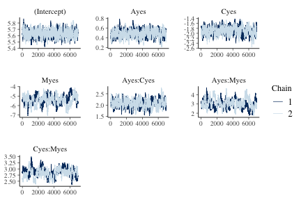
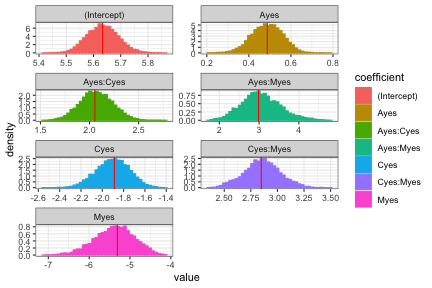

## Introduction

This vignette demonstrates fitting a Poisson regression model via Hamiltonian Monte Carlo (HMC) using the **hmclearn** package.


```r
library(hmclearn)
```

For a count response, we let

$$
p(y | \mu) = \frac{e^{-\mu}\mu^y}{y!},
$$

with a log-link function

$$
\begin{aligned}
\boldsymbol\mu &:= E(\mathbf{y} | \mathbf{X}) = e^{\mathbf{X}\boldsymbol\beta}, \\
\log \boldsymbol\mu &= \mathbf{X}\boldsymbol\beta.
\end{aligned}
$$
The vector of responses is  $\mathbf{y} = (y_1, ..., y_n)^T$. The covariate values for subject $i$ are $\mathbf{x}_i^T = (x_{i0}, ..., x_{iq})$ for $q$ covariates plus an intercept. We write the full design matrix as $\mathbf{X} = (\mathbf{x}_1^T, ..., \mathbf{x}_n^T)^T \in \mathbb{R}^{n\times(q+1)}$ for $n$ observations. The regression coefficients are a vector of length $q + 1$, $\boldsymbol\beta = (\beta_0, ..., \beta_q)^T$.

## Derive log posterior and gradient for HMC

We develop the likelihood

$$
\begin{aligned}
f(\mathbf{y} | \boldsymbol\mu) &= \prod_{i=1}^n \frac{e^{-\mu_i}\mu_i^{y_i}}{y_i!}, \\
f(\mathbf{y} | \mathbf{X}, \boldsymbol\beta) &= \prod_{i=1}^n \frac{e^{-e^{\mathbf{x}_i^T\boldsymbol\beta}}e^{y_i\mathbf{x}_i^T\boldsymbol\beta}}{y_i!}, \\
\end{aligned}
$$

and log-likelihood

$$
\begin{aligned}
f(\mathbf{y} | \mathbf{X}, \boldsymbol\beta) &= \sum_{i=1}^n -e^{\mathbf{x}_i^T\boldsymbol\beta} + y_i \mathbf{x}_i^T \boldsymbol\beta - \log y_i!,  \\
&\propto \sum_{i=1}^n -e^{\mathbf{x}_i^T\boldsymbol\beta} + y_i \mathbf{x}_i^T \boldsymbol\beta.
\end{aligned}
$$

We set a multivariate normal prior for $\boldsymbol\beta$

$$
\begin{aligned}
\boldsymbol\beta &\sim N(0, \sigma_\beta^2 \mathbf{I}),
\end{aligned}
$$

with pdf, omitting constants

$$
\begin{aligned}
\pi(\boldsymbol\beta | \sigma_\beta^2) &= \frac{1}{\sqrt{\lvert 2\pi \sigma_\beta^2 \rvert }}e^{-\frac{1}{2}\boldsymbol\beta^T \boldsymbol\beta / \sigma_\beta^2},  \\
\log \pi(\boldsymbol\beta | \sigma_\beta^2) &= -\frac{1}{2}\log(2\pi \sigma_\beta^2) - \frac{1}{2}\boldsymbol\beta^T \boldsymbol\beta / \sigma_\beta^2, \\
&\propto -\frac{1}{2}\log \sigma_\beta^2 - \frac{\boldsymbol\beta^T\boldsymbol\beta}{2\sigma_\beta^2}.
\end{aligned}
$$

Next, we derive the log posterior, omitting constants,

$$
\begin{aligned}
f(\boldsymbol\beta | \mathbf{X}, \mathbf{y}, \sigma_\beta^2) &\propto f(\mathbf{y} | \mathbf{X}, \boldsymbol\beta) \pi(\boldsymbol\beta | \sigma_\beta^2), \\
\log f(\boldsymbol\beta | \mathbf{X}, \mathbf{y}, \sigma_\beta^2) & \propto \log f(\mathbf{y} | \mathbf{X}, \boldsymbol\beta) + \log \pi(\beta | \sigma_\beta^2), \\
&\propto \sum_{i=1}^n \left( -e^{\mathbf{x}_i^T\boldsymbol\beta} + y_i \mathbf{x}_i^T \boldsymbol\beta\right) - \frac{1}{2}\beta^T\beta/\sigma_\beta^2, \\
&\propto \sum_{i=1}^n \left( -e^{\mathbf{x}_i^T\boldsymbol\beta} + y_i \mathbf{x}_i^T \boldsymbol\beta\right) - \frac{\boldsymbol\beta^T\boldsymbol\beta}{2\sigma_\beta^2}, \\
&\propto \mathbf{y}^T\mathbf{X}\boldsymbol\beta - \mathbf{1}_n^T e^{\mathbf{X}\boldsymbol\beta} - \frac{\boldsymbol\beta^T\boldsymbol\beta}{2\sigma_\beta^2}.
\end{aligned}
$$

We need to derive the gradient of the log posterior for the leapfrog function in HMC.

$$
\begin{aligned}
\nabla_{\boldsymbol\beta}\log f(\boldsymbol\beta|\mathbf{X}, \mathbf{y}, \sigma_\beta^2) &\propto \sum_{i=1}^n\left( -e^{\mathbf{x}_i^T\boldsymbol\beta}\mathbf{x}_i + y_i\mathbf{x}_i\right) - \boldsymbol\beta / \sigma_\beta^2, \\
&\propto \sum_{i=1}^n \mathbf{x}_i\left( -e^{\mathbf{x}_i^T\boldsymbol\beta} + y_i\right) - \boldsymbol\beta / \sigma_\beta^2, \\
&\propto \mathbf{X}^T (\mathbf{y} - e^{\mathbf{X}\boldsymbol\beta}) - \boldsymbol\beta/ \sigma_\beta^2.
\end{aligned}
$$

## Poisson Regression Example Data

The user must define provide the design matrix directly for use in **hmclearn**.  Our first step is to load the data and store the design matrix $X$ and dependent variable vector $y$.

We load drug usage data and create the design matrix $X$ and dependent vector $y$.  This example also appears in Agresti (2015), and we compare results to his.


```r
data(Drugs)

# design matrix
X <- model.matrix(count ~ A + C + M + A:C + A:M + C:M , data=Drugs)
X <- X[, 1:ncol(X)]

# independent variable is count data
y <- Drugs$count
```

## Comparison model - Frequentist

To compare results, we first fit a standard linear model using the frequentist function *glm*.


```r
# matrix representation
f <- glm(y ~ X-1, family=poisson(link=log))
summary(f)
#> 
#> Call:
#> glm(formula = y ~ X - 1, family = poisson(link = log))
#> 
#> Deviance Residuals: 
#>        1         2         3         4         5         6  
#>  0.02044  -0.02658  -0.09256   0.02890  -0.33428   0.09452  
#>        7         8  
#>  0.49134  -0.03690  
#> 
#> Coefficients:
#>              Estimate Std. Error z value Pr(>|z|)    
#> X(Intercept)  5.63342    0.05970  94.361  < 2e-16 ***
#> XAyes         0.48772    0.07577   6.437 1.22e-10 ***
#> XCyes        -1.88667    0.16270 -11.596  < 2e-16 ***
#> XMyes        -5.30904    0.47520 -11.172  < 2e-16 ***
#> XAyes:Cyes    2.05453    0.17406  11.803  < 2e-16 ***
#> XAyes:Myes    2.98601    0.46468   6.426 1.31e-10 ***
#> XCyes:Myes    2.84789    0.16384  17.382  < 2e-16 ***
#> ---
#> Signif. codes:  0 '***' 0.001 '**' 0.01 '*' 0.05 '.' 0.1 ' ' 1
#> 
#> (Dispersion parameter for poisson family taken to be 1)
#> 
#>     Null deviance: 2.4038e+04  on 8  degrees of freedom
#> Residual deviance: 3.7399e-01  on 1  degrees of freedom
#> AIC: 63.417
#> 
#> Number of Fisher Scoring iterations: 4
```

## Fit model using *hmc*

Next, we fit the poisson regression model using HMC.  A vector of $\epsilon$ values are specified to align with the data.


```r
N <- 1e4

eps_vals <- c(rep(5e-4, 2), 1e-3, 2e-3, 1e-3, 2e-3, 5e-4)

set.seed(412)
t1.hmc <- Sys.time()
 f_hmc <- hmc(N = N, theta.init = rep(0, 7),
                    epsilon = eps_vals, L = 50,
                    logPOSTERIOR = poisson_posterior,
                    glogPOSTERIOR = g_poisson_posterior,
                    varnames = colnames(X),
                    parallel=FALSE, chains=2,
                    param=list(y=y, X=X))
t2.hmc <- Sys.time()
t2.hmc - t1.hmc
#> Time difference of 40.8924 secs
```


## MCMC summary and diagnostics

The acceptance ratio for each of the HMC chains is sufficiently high for an efficient simulation.


```r
f_hmc$accept/N
#> [1] 0.9804 0.9829
```

The posterior quantiles are summarized after removing an initial *burnin* period. The $\hat{R}$ statistics provide an indication of convergence. Values close to one indicate that the multiple MCMC chains coverged to the same distribution, while values above 1.1 indicate possible convergence problems. All $\hat{R}$ values in our example are close to one.


```r
summary(f_hmc, burnin=3000, probs=c(0.025, 0.5, 0.975))
#> Summary of MCMC simulation
#>                   2.5%        50%      97.5%     rhat
#> (Intercept)  5.5238199  5.6327435  5.7521131 1.001527
#> Ayes         0.3379506  0.4875867  0.6251244 1.006951
#> Cyes        -2.2176007 -1.8992300 -1.6078705 1.001525
#> Myes        -6.3840770 -5.3643129 -4.4945189 1.007716
#> Ayes:Cyes    1.7495447  2.0670083  2.4061751 1.005151
#> Ayes:Myes    2.1572253  3.0200944  4.1225859 1.018774
#> Cyes:Myes    2.5174705  2.8574315  3.1983475 1.026709
```

Trace plots provide a visual indication of stationarity.  These plots indicate that the MCMC chains are reasonably stationary.


```r
mcmc_trace(f_hmc, burnin=3000)
```



Histograms of the posterior distribution show that Bayesian parameter estimates align with Frequentist estimates.


```r
beta.freq <- coef(f)
diagplots(f_hmc, burnin=3000, comparison.theta=beta.freq)
#> $histogram
```



## Source

Data originally provided by Harry Khamis, Wright State University

## References

Agresti, A. (2015). *Foundations of linear and generalized linear models*. John Wiley & Sons.  ISBN: 978-1-118-73003-4

Thomas, Samuel, and Wanzhu Tu. "Learning Hamiltonian Monte Carlo in R." arXiv preprint arXiv:2006.16194 (2020).

